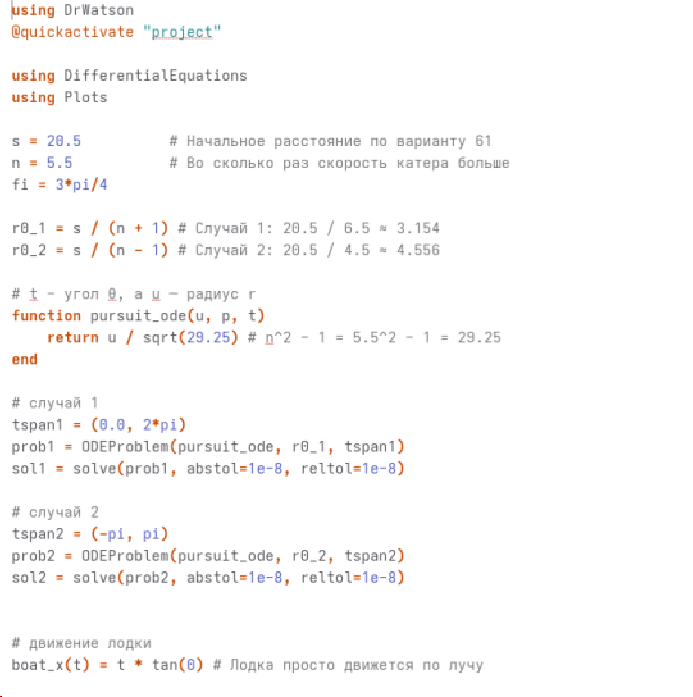

---
## Author
author:
  name: Жибицкая Евгения Дмитриевна
  degrees: 
  orcid: 
  email: 1132236130@rudn.ru
  affiliation:
    - name: Российский университет дружбы народов
      country: Российская Федерация
      postal-code: 117198
      city: Москва
      address: ул. Миклухо-Маклая, д. 6
## Title
title: Лабораторная №2
subtitle: Математическое моделирование
license: CC BY
date: today

---

# Цель работы

## Цель

- Решение задачи о погоне. Анализ условия, выведение уравнения и моделирование траектории движения катера и лодки

# Выполнение лабораторной работы

## Подготовка
:::::::::::::: {.columns align=center}
::: {.column width="50%"}

Перед выполнением лабораторной работы необходимо определить номер варианта для решения задачи
:::
::: {.column width="30%"}

:::
::::::::::::::

## Вариант 61

Вариант 61
На море в тумане катер береговой охраны преследует лодку браконьеров.
Через определенный промежуток времени туман рассеивается, и лодка обнаруживается на расстоянии 20,5 км от катера. Затем лодка снова скрывается в тумане и уходит прямолинейно в неизвестном направлении. Известно, что скорость катера в 5,5 раза больше скорости браконьерской лодки.

1. Запишите уравнение, описывающее движение катера, с начальными
условиями для двух случаев (в зависимости от расположения катера
относительно лодки в начальный момент времени).

2. Постройте траекторию движения катера и лодки для двух случаев.

3. Найдите точку пересечения траектории катера и лодки

## Анализ условия
:::::::::::::: {.columns align=center}
::: {.column width="50%"}

* Начальное расстояние от катера до лодки: $S = 20,5$ км.

* Скорость лодки браконьеров: $v$.

* Скорость катера береговой охраны: $v_k = 5,5v$ ($n = 5,5$).

* Лодка движется прямолинейно в неизвестном направлении.
:::
::: {.column width="50%"}

Стратегия перехвата делится на два этапа:

1. Движение катера по прямой для выравнивания расстояния до полюса с расстоянием лодки.

2. Движение катера по криволинейной траектории (спирали) вокруг полюса с целью пересечения пути лодки.
:::
::::::::::::::

## Анализ условия
:::::::::::::: {.columns align=center}
::: {.column width="50%"}

:::
::: {.column width="50%"}

Траектория катера должна быть такой, чтобы и катер, и лодка все время находились на одинаковом расстоянии от полюса. Поэтому сначала катер должен двигаться прямолинейно, пока не окажется на том же расстоянии от полюса, что и лодка. 

:::
::::::::::::::

## Анализ условия

Решение исходной задачи сводится к численному интегрированию дифференциального уравнения с заданными начальными условиями для двух случаев:

**Для случая 1:**

$$ 
\begin{cases} 
\frac{dr}{d\theta} = \frac{r}{\sqrt{29.25}} \\
r(\theta = 0) = \frac{20.5}{6.5} 
\end{cases} 
$$

**Для случая 2:**

$$ 
\begin{cases} 
\frac{dr}{d\theta} = \frac{r}{\sqrt{29.25}} \\
r(\theta = -\pi) = \frac{20.5}{4.5} 
\end{cases} 
$$

## Программная реализация

## Графики 

# Выводы

## Вывод

- В ходе работы была решена задача о погоне, вариант 61. Также были выведены уравнения и реализовано моделирование 2х случаев из задачи с помощью кода.
