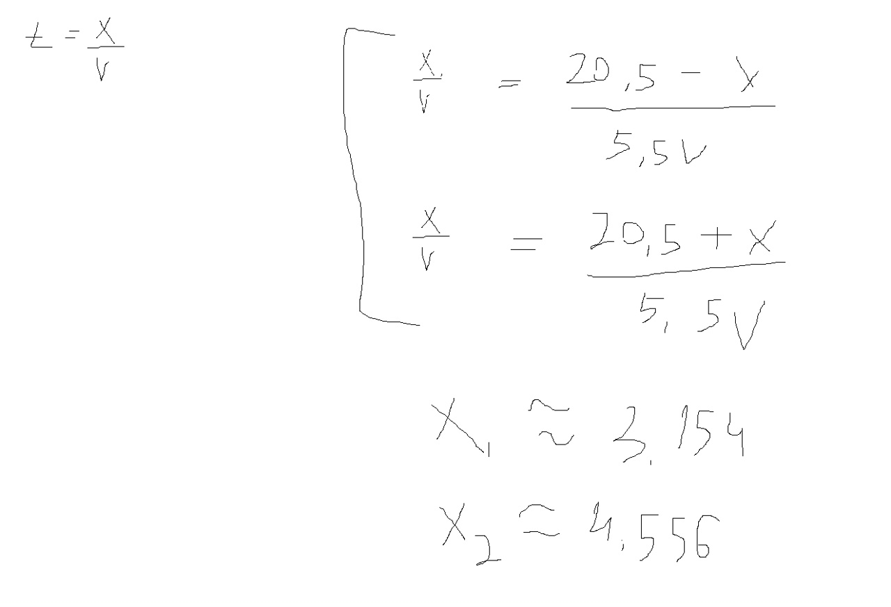
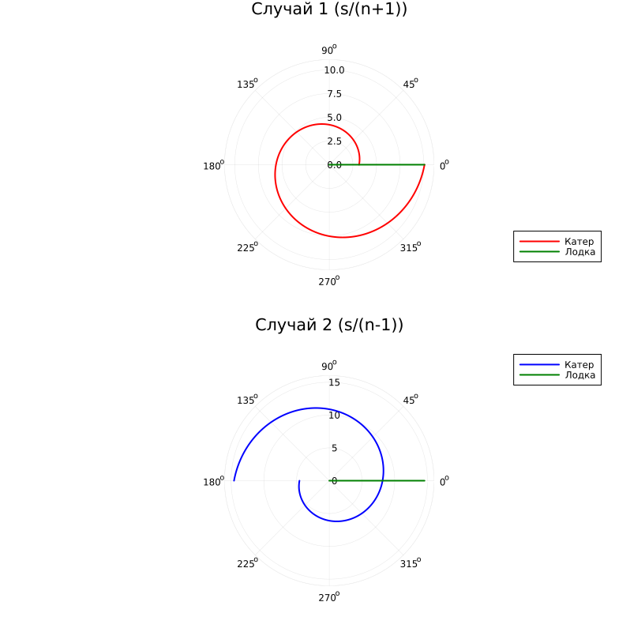

---
## Author
author:
  name: Жибицкая Евгения Дмитриевна
  degrees: 
  orcid: 0000-0002-0877-7063
  email: 1132236130@rudn.ru
  affiliation:
    - name: Российский университет дружбы народов
      country: Российская Федерация
      postal-code: 117198
      city: Москва
      address: ул. Миклухо-Маклая, д. 6

## Title
title: "Лабораторная работа №2"
subtitle: "Дисциплина: Математическое моделирование"
license: "CC BY"
---

# Цель работы

Решение задачи о погоне. Анализ условия, выведение уравнения и  моделирование траектории давижения катера и лодки.


# Выполнение лабораторной работы

Перед выполнением лабораторной работы необходимо определить номер варианта для решения задачи. Сделаем это ([рис. @fig-001]).

{#fig-001 width=70%}


## Математическая модель

Для построения математической модели введем полярную систему координат. Считаем, что полюс (начало координат) — это точка обнаружения лодки браконьеров в начальный момент времени. Полярная ось проходит через точку нахождения катера береговой охраны. 

По условию варианта 61:

* Начальное расстояние от катера до лодки: $S = 20,5$ км.

* Скорость лодки браконьеров: $v$.

* Скорость катера береговой охраны: $v_k = 5,5v$ ($n = 5,5$).

* Лодка движется прямолинейно в неизвестном направлении.

Стратегия перехвата делится на два этапа:

1. Движение катера по прямой для выравнивания расстояния до полюса с расстоянием лодки.

2. Движение катера по криволинейной траектории (спирали) вокруг полюса с целью пересечения пути лодки.

Определение начальных условий 

Траектория катера должна быть такой, чтобы и катер, и лодка все время находились на одинаковом расстоянии от полюса. Поэтому сначала катер должен двигаться прямолинейно, пока не окажется на том же расстоянии от полюса, что и лодка. 

Пусть $t$ — время, через которое катер и лодка окажутся на одном расстоянии $x$ от полюса. 

За это время лодка пройдет расстояние $x$ со скоростью $v$. 
Катер за это же время пройдет расстояние $20,5 - x$ (если движется навстречу лодке) или $20,5 + x$ (если движется от лодки вдогонку), со скоростью $5,5v$.

Так как время движения до этой точки одинаково, составим уравнение кинематики([рис. @fig-002]).

{#fig-002 width=70%}


Вывод дифференциального уравнения траектории 

После того как катер достиг нужного расстояния, он начинает двигаться вокруг полюса. Чтобы расстояние от полюса до катера и лодки оставалось одинаковым, **радиальная скорость** катера $v_r$ (скорость удаления от полюса) должна быть равна скорости лодки $v$:
$$ v_r = \frac{dr}{dt} = v $$

Общую скорость катера $v_k = 5,5v$ можно разложить на радиальную $v_r$ и тангенциальную $v_\tau$ составляющие. По теореме Пифагора:
$$ v_k^2 = v_r^2 + v_\tau^2 $$
$$ (5,5v)^2 = v^2 + v_\tau^2 $$
$$ 30,25v^2 = v^2 + v_\tau^2 $$
$$ v_\tau^2 = 29,25v^2 \implies v_\tau = v\sqrt{29,25} $$

Известно, что тангенциальная скорость (линейная скорость вращения относительно полюса) вычисляется через угловую скорость как:
$$ v_\tau = r \cdot \frac{d\theta}{dt} = v\sqrt{29,25} $$

Таким образом, мы получаем систему из двух дифференциальных уравнений:
$$
\begin{cases} 
\frac{dr}{dt} = v \\ 
r\frac{d\theta}{dt} = v\sqrt{29,25} 
\end{cases}
$$

Исключим из системы параметр времени $t$, разделив первое уравнение на второе:
$$ \frac{\frac{dr}{dt}}{r\frac{d\theta}{dt}} = \frac{v}{v\sqrt{29,25}} $$
$$ \frac{dr}{r \cdot d\theta} = \frac{1}{\sqrt{29,25}} $$

Отсюда получаем итоговое дифференциальное уравнение, описывающее траекторию движения катера береговой охраны:
$$ \frac{dr}{d\theta} = \frac{r}{\sqrt{29,25}} $$


Решение исходной задачи сводится к численному интегрированию дифференциального уравнения с заданными начальными условиями для двух случаев:

**Для случая 1:**
$$
\begin{cases}
\frac{dr}{d\theta} = \frac{r}{\sqrt{29,25}} \\
r(\theta = 0) = \frac{20,5}{6,5}
\end{cases}
$$


**Для случая 2:**
$$
\begin{cases}
\frac{dr}{d\theta} = \frac{r}{\sqrt{29,25}} \\
r(\theta = -\pi) = \frac{20,5}{4,5}
\end{cases}
$$


## Программная реализация

Реализуем также код, моделирующий описанную выше задачу.

```
using DrWatson
@quickactivate "project" 

using DifferentialEquations
using Plots

s = 20.5          
n = 5.5          
fi = 3*pi/4       

r0_1 = s / (n + 1) #  20.5 / 6.5 ≈ 3.154
r0_2 = s / (n - 1) #  20.5 / 4.5 ≈ 4.556


function pursuit_ode(u, p, t)
    return u / sqrt(29.25) # n^2 - 1 = 5.5^2 - 1 = 29.25
end

# 1
tspan1 = (0.0, 2*pi)
prob1 = ODEProblem(pursuit_ode, r0_1, tspan1)
sol1 = solve(prob1, abstol=1e-8, reltol=1e-8)

# 2
tspan2 = (-pi, pi)
prob2 = ODEProblem(pursuit_ode, r0_2, tspan2)
sol2 = solve(prob2, abstol=1e-8, reltol=1e-8)


boat_x(t) = t * tan(0)

p1 = plot(sol1, proj=:polar, label="Катер", title="Случай 1 (s/(n+1))", c=:red, lw=2)
plot!(p1, [0.0, 0.0], [0.0, maximum(sol1.u)], label="Лодка", c=:green, lw=2)


p2 = plot(sol2, proj=:polar, label="Катер", title="Случай 2 (s/(n-1))", c=:blue, lw=2)
plot!(p2, [0.0, 0.0], [0.0, maximum(sol2.u)], label="Лодка", c=:green, lw=2)

plot(p1, p2, layout=(2, 1), size=(800, 800))
savefig("plots/lab02_results.png")
println("Графики сохранены в файл plots/lab02_results.png")

```


Реализация кода ([рис. @fig-003]).

{#fig-003 width=70%}


```
model PursuitProblem_Var61
  // Параметры варианта 61
  parameter Real s = 20.5;
  parameter Real n = 5.5;
  
  // Начальные условия
  parameter Real r0_1 = s / (n + 1); // Случай 1: ≈ 3.154
  parameter Real r0_2 = s / (n - 1); // Случай 2: ≈ 4.556
  
  // Переменные радиуса для двух случаев (start задает начальные условия)
  Real r1(start=r0_1, fixed=true);
  Real r2(start=r0_2, fixed=true);
  
  // Углы (аналог переменной t в Julia)
  Real theta1;
  Real theta2;

equation
  // В Modelica 'time' выступает в роли независимой переменной.
  // Для симуляции необходимо в настройках (Simulation Setup) задать Stop Time = 6.283 (это 2*pi)
  
  // случай 1 (угол от 0 до 2*pi)
  theta1 = time;
  der(r1) = r1 / sqrt(29.25); // 5.5^2 - 1 = 29.25
  
  // случай 2 (угол от -pi до pi)
  // Чтобы производная d(r2)/d(theta2) была корректной, d(theta2)/dt равно 1
  theta2 = time - Modelica.Constants.pi; 
  der(r2) = r2 / sqrt(29.25);

end PursuitProblem_Var61;

```


Графики для задачи о погоне([рис. @fig-004]).

{#fig-004 width=70%}


# Выводы

В ходе работы была решена задача о погоне, вариант 61. Также были выведены уравнения и реализовано моделирование 2х случаев из задачи с помощью кода.


# Список литературы{.unnumbered}

[ТУИС](https://esystem.rudn.ru/pluginfile.php/3094827/mod_resource/content/2/%D0%9B%D0%B0%D0%B1%D0%BE%D1%80%D0%B0%D1%82%D0%BE%D1%80%D0%BD%D0%B0%D1%8F%20%D1%80%D0%B0%D0%B1%D0%BE%D1%82%D0%B0%20%E2%84%96%201.pdf)

::: {#refs}
:::
