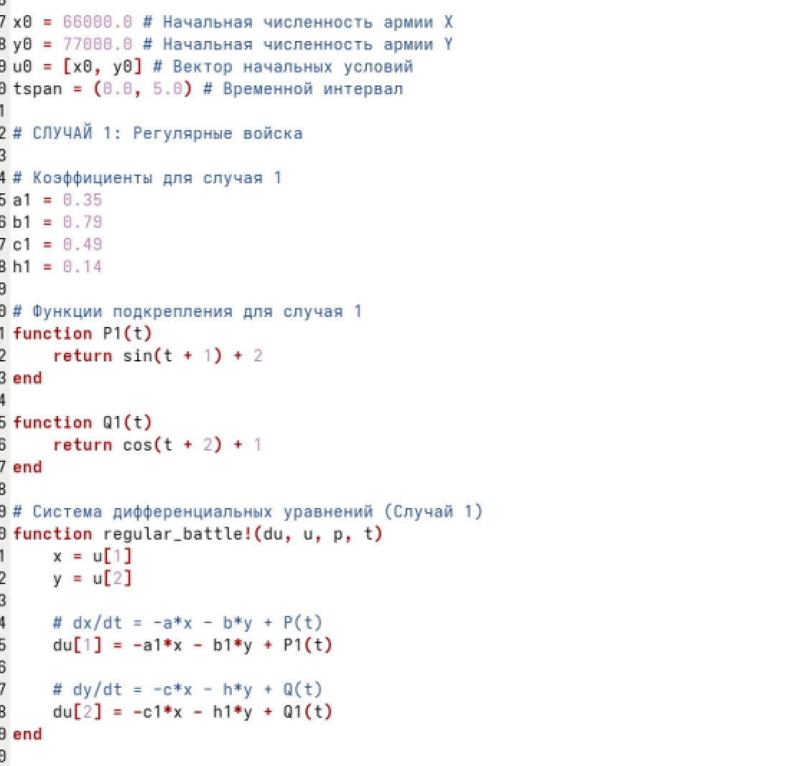

---
## Author
author:
  name: Жибицкая Евгения Дмитриевна
  degrees: 
  orcid: 
  email: 1132236130@rudn.ru
  affiliation:
    - name: Российский университет дружбы народов
      country: Российская Федерация
      postal-code: 117198
      city: Москва
      address: ул. Миклухо-Маклая, д. 6
## Title
title: Лабораторная №3
subtitle: Математическое моделирование
license: CC BY
date: today

---

# Цель работы

## Цель

- Решение задачи о боевых действиях. Анализ условия,моделирование боевых действий в зависимости от различных параметров и построение графиков. 

# Выполнение лабораторной работы

## Подготовка
:::::::::::::: {.columns align=center}
::: {.column width="50%"}

Перед выполнением лабораторной работы необходимо определить номер варианта для решения задачи
:::
::: {.column width="30%"}

:::
::::::::::::::

## Вариант 61
:::::::::::::: {.columns align=center}
::: {.column width="50%"}

:::
::::::::::::::

## Вариант 61. Анализ условия

В данной лабораторной работе рассматривается модель боевых действий — модель Ланчестера. 

Динамика изменения численности армий описывается системой ОДУ, где производные $\frac{dx}{dt}$ и $\frac{dy}{dt}$ характеризуют скорости изменения численности соответствующих армий.

На изменение численности влияют три основных фактора:

1. **Небоевые потери** (болезни, дезертирство, небоевые травмы) — пропорциональны численности самой армии. Задаются коэффициентами $a(t)$ и $h(t)$.

2. **Боевые потери** — зависят от типа ведения боя и численности армий. Задаются коэффициентами боевой эффективности $b(t)$ и $c(t)$.

3. **Подкрепление** — подход свежих сил, который задается функциями $P(t)$ и $Q(t)$.

В зависимости от тактики ведения боя рассматриваются две различные математические модели.

## Модель боевых действий между регулярными армиями
:::::::::::::: {.columns align=center}
::: {.column width="50%"}

Если обе армии ведут бой регулярными частями (на открытой местности), то потери каждой из сторон пропорциональны численности вражеской армии. Чем больше численность армии противника, тем больше огневая мощь и, следовательно, тем выше потери.

:::
::: {.column width="50%"}

$$
\begin{cases}
\frac{dx}{dt} = -a(t)x(t) - b(t)y(t) + P(t) \\
\frac{dy}{dt} = -c(t)x(t) - h(t)y(t) + Q(t)
\end{cases}
$$

Где:
* $-a(t)x(t)$ и $-h(t)y(t)$ — небоевые потери армий $X$ и $Y$ соответственно.

* $-b(t)y(t)$ и $-c(t)x(t)$ — боевые потери, зависящие только от численности противника.

* $P(t)$ и $Q(t)$ — функции, описывающие поступление подкреплений.

:::
::::::::::::::

## Модель боевых действий с участием партизанских отрядов
:::::::::::::: {.columns align=center}
::: {.column width="50%"}

В случае, когда одна из армий ведет партизанскую войну, а вторая — регулярная, характер потерь меняется. 

Регулярная армия, не имея четких целей, ведет стрельбу по площадям, боевые потери партизан зависят не только от огневой мощи регулярной армии (численности $Y$), но и от плотности расположения партизан (численности $X$). Таким образом, потери партизан пропорциональны произведению численностей обеих армий.
При этом регулярная армия $Y$ несет потери так же, как и в открытом бою (пропорционально численности партизан).

:::
::: {.column width="50%"}

Система дифференциальных уравнений принимает вид:

$$
\begin{cases}
\frac{dx}{dt} = -a(t)x(t) - b(t)x(t)y(t) + P(t) \\
\frac{dy}{dt} = -c(t)x(t) - h(t)y(t) + Q(t)
\end{cases}
$$

Где член $-b(t)x(t)y(t)$ отражает специфику боевых потерь партизанской армии от «ковровых» бомбардировок или стрельбы по площадям.
:::
::::::::::::::

## Программная реализация

:::::::::::::: {.columns align=center}
::: {.column width="40%"}

:::
::: {.column width="40%"}

:::
::::::::::::::

## Графики 

:::::::::::::: {.columns align=center}
::: {.column width="50%"}

:::
::::::::::::::

# Выводы

## Вывод

- В ходе работы была решена задача о боевых действиях, вариант 61. Также было реализовано моделирование 2х случаев из задачи с помощью кода, построены графики
