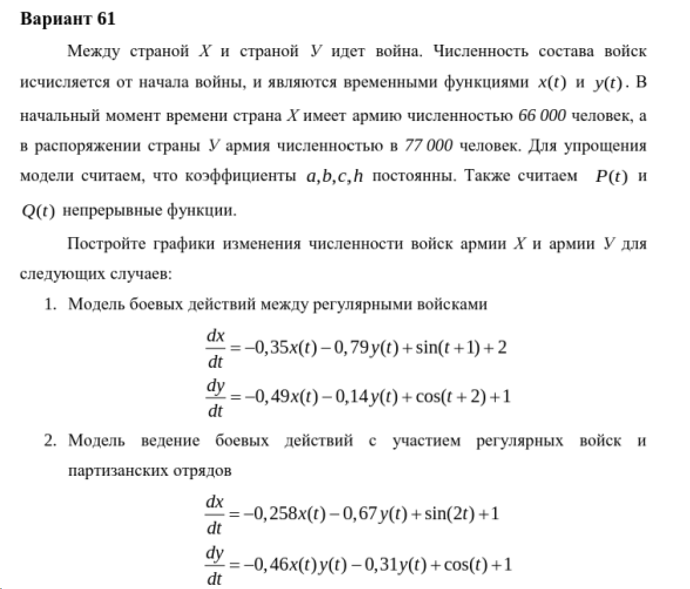
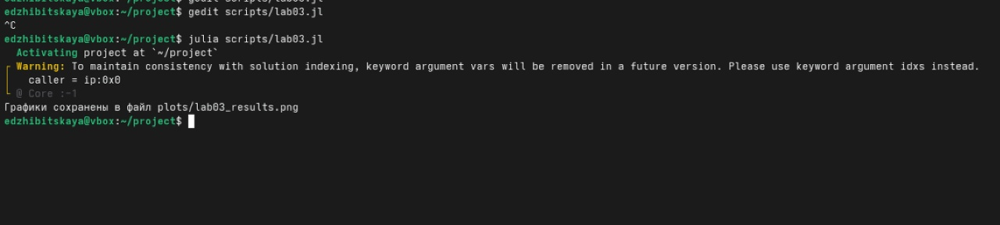
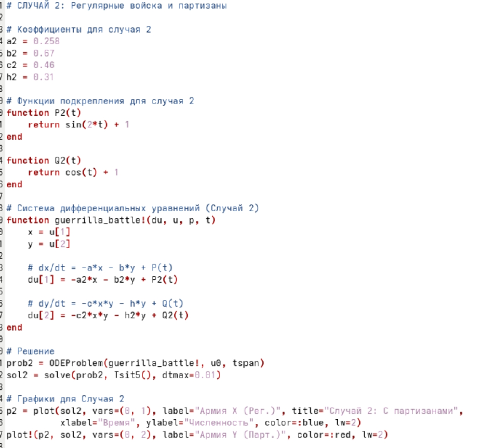
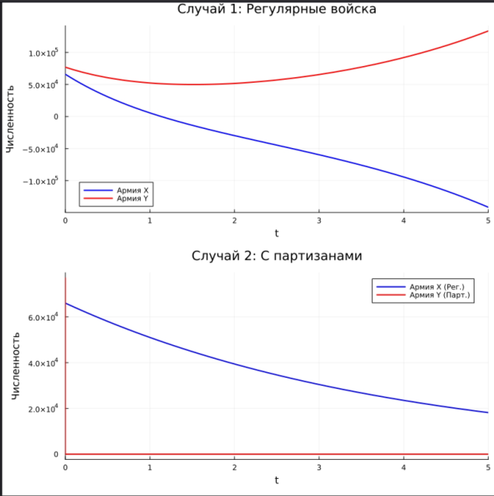

---
## Author
author:
  name: Жибицкая Евгения Дмитриевна
  degrees: 
  orcid: 0000-0002-0877-7063
  email: 1132236130@rudn.ru
  affiliation:
    - name: Российский университет дружбы народов
      country: Российская Федерация
      postal-code: 117198
      city: Москва
      address: ул. Миклухо-Маклая, д. 6

## Title
title: "Лабораторная работа №3"
subtitle: "Дисциплина: Математическое моделирование"
license: "CC BY"
---

# Цель работы

Моделирование гармонических колебаний. Анализ условия, решение уравнения гармонического осциллятора для различных случаев(с затуханием и без, с воздействием внешней силы), построение фазового портрета.


# Выполнение лабораторной работы

Перед выполнением лабораторной работы необходимо определить номер варианта для решения задачи. Сделаем это ([рис. @fig-001]).

{#fig-001 width=70%}


{#fig-001 width=70%}


## Математическая модель

В данной лабораторной работе рассматривается модель боевых действий — модель Ланчестера. 

Пусть численность первой армии равна $x(t)$, а численность второй армии — $y(t)$. Динамика изменения численности армий описывается системой обыкновенных дифференциальных уравнений, где производные $\frac{dx}{dt}$ и $\frac{dy}{dt}$ характеризуют скорости изменения численности соответствующих армий.

На изменение численности влияют три основных фактора:

1. **Небоевые потери** (болезни, дезертирство, небоевые травмы) — пропорциональны численности самой армии. Задаются коэффициентами $a(t)$ и $h(t)$.

2. **Боевые потери** — зависят от типа ведения боя и численности армий. Задаются коэффициентами боевой эффективности $b(t)$ и $c(t)$.

3. **Подкрепление** — подход свежих сил, который задается функциями $P(t)$ и $Q(t)$.

В зависимости от тактики ведения боя рассматриваются две различные математические модели.

### Модель боевых действий между регулярными армиями

Если обе армии ведут бой регулярными частями (на открытой местности), то потери каждой из сторон пропорциональны численности вражеской армии. Чем больше численность армии противника, тем больше огневая мощь и, следовательно, тем выше потери.

Система дифференциальных уравнений для этого случая имеет вид:

$$
\begin{cases}
\frac{dx}{dt} = -a(t)x(t) - b(t)y(t) + P(t) \\
\frac{dy}{dt} = -c(t)x(t) - h(t)y(t) + Q(t)
\end{cases}
$$

Где:
* $-a(t)x(t)$ и $-h(t)y(t)$ — небоевые потери армий $X$ и $Y$ соответственно.
* $-b(t)y(t)$ и $-c(t)x(t)$ — боевые потери, зависящие только от численности противника.
* $P(t)$ и $Q(t)$ — функции, описывающие поступление подкреплений.

### Модель боевых действий с участием партизанских отрядов

В случае, когда одна из армий (например, армия $X$) ведет партизанскую войну, а вторая (армия $Y$) — регулярная, характер потерь меняется. 

Регулярная армия, не имея четких целей, ведет стрельбу по площадям. В этом случае боевые потери партизан зависят не только от огневой мощи регулярной армии (численности $Y$), но и от плотности расположения самих партизан (численности $X$). Таким образом, потери партизан пропорциональны произведению численностей обеих армий.
При этом регулярная армия $Y$ несет потери так же, как и в открытом бою (пропорционально численности партизан).

Система дифференциальных уравнений принимает вид:

$$
\begin{cases}
\frac{dx}{dt} = -a(t)x(t) - b(t)x(t)y(t) + P(t) \\
\frac{dy}{dt} = -c(t)x(t) - h(t)y(t) + Q(t)
\end{cases}
$$

Где член $-b(t)x(t)y(t)$ отражает специфику боевых потерь партизанской армии от «ковровых» бомбардировок или стрельбы по площадям.

### Постановка задачи 

Для моделирования динамики боевых действий необходимо решить представленные системы дифференциальных уравнений численными методами, задав начальные условия — численность армий в момент времени $t = 0$:

$$
\begin{cases}
x(0) = x_0 \\
y(0) = y_0
\end{cases}
$$


## Программная реализация

Реализуем также код, моделирующий описанную выше задачу.

```
using DrWatson
@quickactivate "project" 

using DifferentialEquations
using Plots

x0 = 66000.0  
y0 = 77000.0 
u0 = [x0, y0] 
tspan = (0.0, 5.0) 

# 1: 

a1 = 0.35
b1 = 0.79
c1 = 0.49
h1 = 0.14


function P1(t)
    return sin(t + 1) + 2
end

function Q1(t)
    return cos(t + 2) + 1
end

function regular_battle!(du, u, p, t)
    x = u[1]
    y = u[2]
    
    # dx/dt = -a*x - b*y + P(t)
    du[1] = -a1*x - b1*y + P1(t)
    
    # dy/dt = -c*x - h*y + Q(t)
    du[2] = -c1*x - h1*y + Q1(t)
end


prob1 = ODEProblem(regular_battle!, u0, tspan)
sol1 = solve(prob1, Tsit5(), dtmax=0.01) 

p1 = plot(sol1, vars=(0, 1), label="Армия X", title="Случай 1: Регулярные войска", 
          xlabel="Время", ylabel="Численность", color=:blue, lw=2)
plot!(p1, sol1, vars=(0, 2), label="Армия Y", color=:red, lw=2)


#  2:

a2 = 0.258
b2 = 0.67
c2 = 0.46
h2 = 0.31


function P2(t)
    return sin(2*t) + 1
end

function Q2(t)
    return cos(t) + 1
end

function guerrilla_battle!(du, u, p, t)
    x = u[1]
    y = u[2]
    
    # dx/dt = -a*x - b*y + P(t)
    du[1] = -a2*x - b2*y + P2(t)
    
    # dy/dt = -c*x*y - h*y + Q(t)
    du[2] = -c2*x*y - h2*y + Q2(t)
end


prob2 = ODEProblem(guerrilla_battle!, u0, tspan)
sol2 = solve(prob2, Tsit5(), dtmax=0.01)


p2 = plot(sol2, vars=(0, 1), label="Армия X (Рег.)", title="Случай 2: С партизанами", 
          xlabel="Время", ylabel="Численность", color=:blue, lw=2)
plot!(p2, sol2, vars=(0, 2), label="Армия Y (Парт.)", color=:red, lw=2)

plot(p1, p2, layout=(2, 1), size=(800, 800))
savefig("plot/lab03_results.png")
println("Графики сохранены в файл plots/lab03_results.png")

```


Реализация кода ([рис. @fig-002], [рис. @fig-003] и [рис. @fig-004]).

{#fig-002 width=70%}

{#fig-003 width=70%}

{#fig-004 width=70%}


```
model CombatModel_Var61

  
  parameter Real x0 = 66000.0; 
  parameter Real y0 = 77000.0;
  
  

  parameter Real a1 = 0.35;
  parameter Real b1 = 0.79;
  parameter Real c1 = 0.49;
  parameter Real h1 = 0.14;
  
  Real x1(start=x0);
  Real y1(start=y0);
  
  
  parameter Real a2 = 0.258;
  parameter Real b2 = 0.67;
  parameter Real c2 = 0.46;
  parameter Real h2 = 0.31;
  
  
  Real x2(start=x0);
  Real y2(start=y0);

equation
  
  // dx/dt = -a*x - b*y + P(t)
  der(x1) = -a1*x1 - b1*y1 + sin(time + 1) + 2;
  // dy/dt = -c*x - h*y + Q(t)
  der(y1) = -c1*x1 - h1*y1 + cos(time + 2) + 1;
  
 
  // dx/dt = -a*x - b*y + P(t)
  der(x2) = -a2*x2 - b2*y2 + sin(2*time) + 1;
  // dy/dt = -c*x*y - h*y + Q(t)
  der(y2) = -c2*x2*y2 - h2*y2 + cos(time) + 1;

end CombatModel_Var61;
```


Модель боевых действий([рис. @fig-005]).

{#fig-005 width=70%}


# Выводы

В ходе работы была построена модель гармонических колебаний. Был произведен анализ условия, решение уравнения гармонического осциллятора для различных случаев(с затуханием и без, с воздействием внешней силы), построены фазового портрета.


# Список литературы{.unnumbered}

[ТУИС](https://esystem.rudn.ru/pluginfile.php/3094831/mod_resource/content/2/%D0%9B%D0%B0%D0%B1%D0%BE%D1%80%D0%B0%D1%82%D0%BE%D1%80%D0%BD%D0%B0%D1%8F%20%D1%80%D0%B0%D0%B1%D0%BE%D1%82%D0%B0%20%E2%84%96%202.pdf)

::: {#refs}
:::
