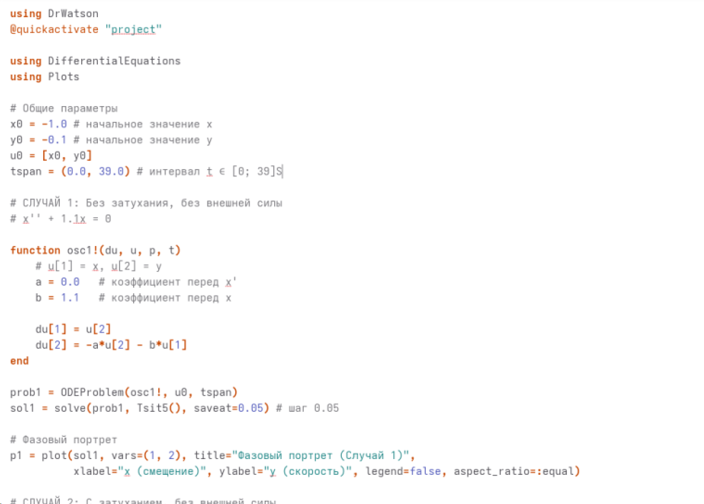

---
## Author
author:
  name: Жибицкая Евгения Дмитриевна
  degrees: 
  orcid: 
  email: 1132236130@rudn.ru
  affiliation:
    - name: Российский университет дружбы народов
      country: Российская Федерация
      postal-code: 117198
      city: Москва
      address: ул. Миклухо-Маклая, д. 6
## Title
title: Лабораторная №4
subtitle: Математическое моделирование
license: CC BY
date: today

---

# Цель работы

## Цель

- Моделирование гармонических колебаний. Анализ условия, решение уравнения гармонического осциллятора для различных случаев (с затуханием и без, с воздействием внешней силы), построение фазового портрета.

# Выполнение лабораторной работы

## Подготовка
:::::::::::::: {.columns align=center}
::: {.column width="50%"}

Перед выполнением лабораторной работы необходимо определить номер варианта для решения задачи
:::
::: {.column width="50%"}

:::
::::::::::::::

## Вариант 61
:::::::::::::: {.columns align=center}
::: {.column width="50%"}

:::
::::::::::::::

## Вариант 61. Анализ условия

В лабораторной работе исследуется линейный гармонический осциллятор – система, описывающая свободные и вынужденные колебания. Состояние системы характеризуется переменной x(t) (смещение, заряд).

Для однозначного решения всех типов задач необходимо задать начальное положение и скорость:

 x0,   y0

## Свободные колебания без затухания
:::::::::::::: {.columns align=center}
::: {.column width="50%"}

Простейшая модель (консервативный осциллятор) имеет вид:

x'' + w0^2 x = 0,

где w0 – собственная частота колебаний.  
Для численного решения введём переменную y = x' (скорость):

x' = y,   y' = -w0^2 x.

:::
::: {.column width="50%"}

Общее решение: x(t) = A cos(w0 t + φ), фазовая траектория – эллипс.

:::
::::::::::::::

##  Свободные колебания с затуханием

При наличии трения уравнение дополняется членом, пропорциональным скорости:

x'' + 2γ x' + w0^2 x = 0,

где γ – коэффициент затухания (γ > 0).  
В форме системы:

x' = y,   y' = -2γ y - w0^2 x.

В зависимости от γ и w0 возможны затухающие колебания (γ < w0) или апериодический режим.

## Вынужденные колебания

При действии внешней периодической силы f(t) (например, f(t) = cos(Ω t)) уравнение становится неоднородным:

x'' + 2γ x' + w0^2 x = f(t).

Система:

x' = y,   y' = -2γ y - w0^2 x + f(t).

При установлении режима вынужденных колебаний фазовая траектория стремится к предельному циклу.

## Программная реализация

:::::::::::::: {.columns align=center}
::: {.column width="40%"}

:::
::: {.column width="40%"}

:::
::::::::::::::

## Графики 

:::::::::::::: {.columns align=center}
::: {.column width="50%"}

:::
::: {.column width="50%"}
- Без затухания (γ=0) фазовые траектории – замкнутые кривые (эллипсы), энергия сохраняется.

- С затуханием (γ>0) траектории скручиваются к началу координат – равновесие устойчиво.

- При внешнем воздействии после переходного процесса устанавливаются вынужденные колебания; на фазовой плоскости – предельный цикл. При совпадении частот – резонанс.
:::
::::::::::::::

## Ответы на вопросы

1. Простейшая модель гармонических колебаний
x'' + w0^2 x = 0, где w0 – собственная частота.

2. Определение осциллятора
Осциллятор – система, совершающая колебания около положения равновесия.

 В широком смысле – любая система, динамика которой описывается дифференциальными уравнениями, допускающими колебательные решения. Линейный гармонический осциллятор – простейшая модель, в которой возвращающая сила пропорциональна отклонению от равновесия.
 
3. Модель математического маятника

Математический маятник – это материальная точка массой m, подвешенная на невесомой нерастяжимой нити длиной l, совершающая колебания в вертикальной плоскости под действием силы тяжести.
Для малых углов: θ'' + (g/l) θ = 0, где g – ускорение свободного падения, l – длина нити.

## Ответы на вопросы

4. Алгоритм перехода от уравнения второго порядка к системе первого порядка

- Ввести y = x'.

- Получим систему: x' = y, y' = f(t, x, y).

- Начальные условия переходят в начальные условия для системы: x(t0)=x0, y(t0)=y0.

5. Фазовый портрет и фазовая траектория

Фазовая плоскость: (x, y).

Фазовая траектория – кривая, описывающая эволюцию состояния.

Фазовый портрет – совокупность траекторий для разных начальных условий.

# Выводы

## Вывод

- В ходе работы была построена модель гармонических колебаний. Был произведен анализ условия, решение уравнения гармонического осциллятора для различных случаев(с затуханием и без, с воздействием внешней силы), построен фазовый портрет.
