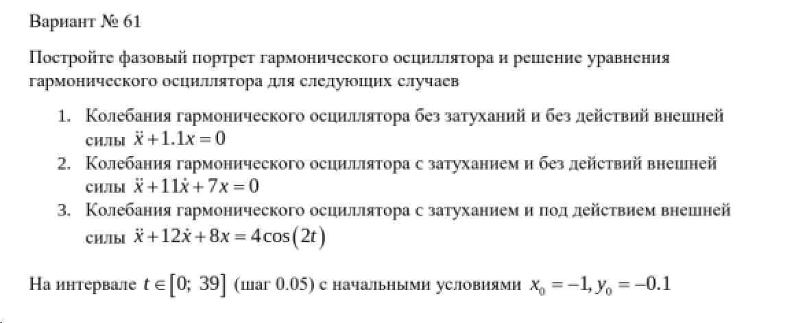
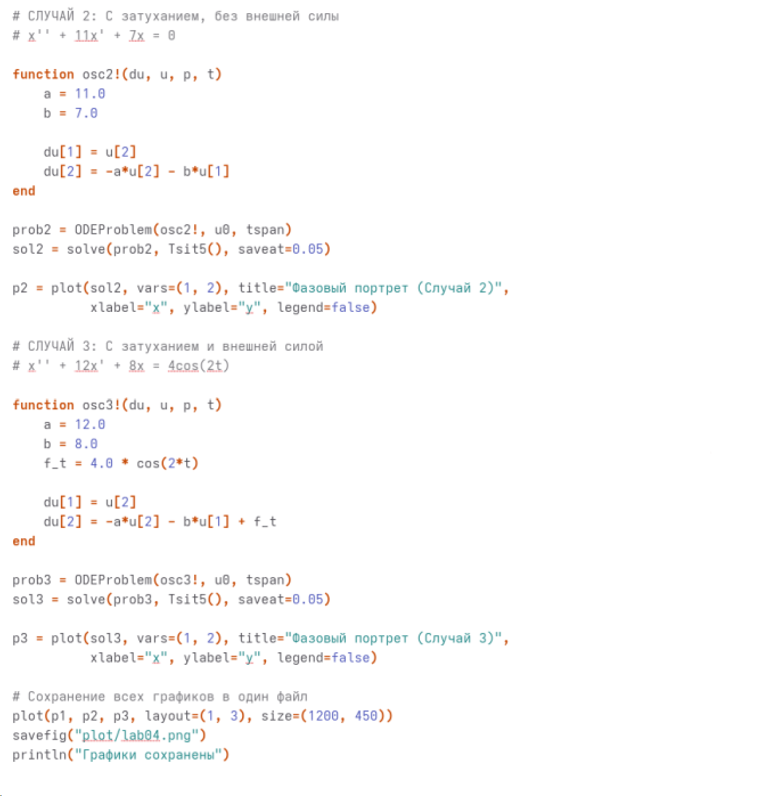
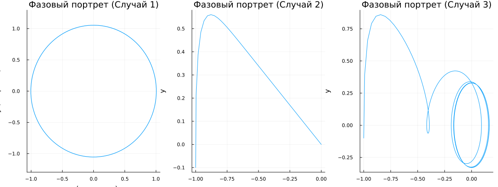

---
## Author
author:
  name: Жибицкая Евгения Дмитриевна
  degrees: 
  orcid: 0000-0002-0877-7063
  email: 1132236130@rudn.ru
  affiliation:
    - name: Российский университет дружбы народов
      country: Российская Федерация
      postal-code: 117198
      city: Москва
      address: ул. Миклухо-Маклая, д. 6

## Title
title: "Лабораторная работа №4"
subtitle: "Дисциплина: Математическое моделирование"
license: "CC BY"
---

# Цель работы

Моделирование гармонических колебаний. Анализ условия, решение уравнения гармонического осциллятора для различных случаев (с затуханием и без, с воздействием внешней силы), построение фазового портрета.

# Выполнение лабораторной работы

Перед выполнением лабораторной работы необходимо определить номер варианта для решения задачи. Сделаем это (рис. [-@fig-001]).

{#fig-001 width=70%}

{#fig-002 width=70%}

## Математическая модель

В лабораторной работе исследуется линейный гармонический осциллятор – система, описывающая свободные и вынужденные колебания. Состояние системы характеризуется переменной x(t) (смещение, заряд).

### 1. Свободные колебания без затухания

Простейшая модель (консервативный осциллятор) имеет вид:

x'' + w0^2 x = 0,

где w0 – собственная частота колебаний.  
Для численного решения введём переменную y = x' (скорость):

x' = y,   y' = -w0^2 x.

Общее решение: x(t) = A cos(w0 t + φ), фазовая траектория – эллипс.

### 2. Свободные колебания с затуханием

При наличии трения уравнение дополняется членом, пропорциональным скорости:

x'' + 2γ x' + w0^2 x = 0,

где γ – коэффициент затухания (γ > 0).  
В форме системы:

x' = y,   y' = -2γ y - w0^2 x.

В зависимости от γ и w0 возможны затухающие колебания (γ < w0) или апериодический режим.

### 3. Вынужденные колебания

При действии внешней периодической силы f(t) (например, f(t) = cos(Ω t)) уравнение становится неоднородным:

x'' + 2γ x' + w0^2 x = f(t).

Система:

x' = y,   y' = -2γ y - w0^2 x + f(t).

При установлении режима вынужденных колебаний фазовая траектория стремится к предельному циклу.

### Начальные условия

Для однозначного решения необходимо задать начальное положение и скорость:

x(0) = x0,   y(0) = y0.

### Фазовый портрет

Фазовое пространство – плоскость (x, y). Кривая (x(t), y(t)) – фазовая траектория. Совокупность траекторий для разных начальных условий – фазовый портрет.

## Задача

Необходимо выполнить численное моделирование для трёх случаев:

1. **Без затухания и внешней силы** – построить решение x(t) и фазовый портрет.
2. **С затуханием** – задать γ > 0, построить x(t) и фазовый портрет.
3. **С внешней силой** – выбрать f(t), построить x(t) и фазовый портрет.

Параметры выбираются в соответствии с вариантом.

**Ключевые выводы:**

- Без затухания (γ=0) фазовые траектории – замкнутые кривые (эллипсы), энергия сохраняется.
- С затуханием (γ>0) траектории скручиваются к началу координат – равновесие устойчиво.
- При внешнем воздействии после переходного процесса устанавливаются вынужденные колебания; на фазовой плоскости – предельный цикл. При совпадении частот – резонанс.

## Программная реализация

Реализуем код на Julia.

```
using DrWatson
@quickactivate "project" 
using DifferentialEquations
using Plots

x0 = -1.0
y0 = -0.1 
u0 = [x0, y0]
tspan = (0.0, 39.0)

# Случай 1: x'' + 1.1 x = 0
function osc1!(du, u, p, t)
    a = 0.0; b = 1.1
    du[1] = u[2]
    du[2] = -a*u[2] - b*u[1] 
end
prob1 = ODEProblem(osc1!, u0, tspan)
sol1 = solve(prob1, Tsit5(), saveat=0.05)
p1 = plot(sol1, vars=(1,2), title="Фазовый портрет (Случай 1)", 
          xlabel="x", ylabel="y", legend=false, aspect_ratio=:equal)

# Случай 2: x'' + 11 x' + 7 x = 0
function osc2!(du, u, p, t)
    a = 11.0; b = 7.0
    du[1] = u[2]
    du[2] = -a*u[2] - b*u[1]
end
prob2 = ODEProblem(osc2!, u0, tspan)
sol2 = solve(prob2, Tsit5(), saveat=0.05)
p2 = plot(sol2, vars=(1,2), title="Фазовый портрет (Случай 2)", 
          xlabel="x", ylabel="y", legend=false)

# Случай 3: x'' + 12 x' + 8 x = 4 cos(2t)
function osc3!(du, u, p, t)
    a = 12.0; b = 8.0
    f = 4.0 * cos(2*t)
    du[1] = u[2]
    du[2] = -a*u[2] - b*u[1] + f
end
prob3 = ODEProblem(osc3!, u0, tspan)
sol3 = solve(prob3, Tsit5(), saveat=0.05)
p3 = plot(sol3, vars=(1,2), title="Фазовый портрет (Случай 3)", 
          xlabel="x", ylabel="y", legend=false)

plot(p1, p2, p3, layout=(1,3), size=(1200,450))
savefig("plot/lab04.png")
println("Графики сохранены")

```


Реализация кода ([рис. @fig-003] и [рис. @fig-004]).


{#fig-003 width=70%}

{#fig-004 width=70%}


```

package Oscillators

  // 1: 
  // x'' + 1.1 x = 0
  model Oscillator1
    parameter Real w2 = 1.1 "Квадрат собственной частоты (omega^2)";
    Real x(start = -1.0) "Смещение";
    Real y(start = -0.1) "Скорость";
  equation
    der(x) = y;
    der(y) = -w2 * x;
  end Oscillator1;

  //  2: 
  // x'' + 11 x' + 7 x = 0
  model Oscillator2
    parameter Real a = 11.0 "Коэффициент затухания (2*gamma)";
    parameter Real b = 7.0  "Квадрат собственной частоты";
    Real x(start = -1.0);
    Real y(start = -0.1);
  equation
    der(x) = y;
    der(y) = -a * y - b * x;
  end Oscillator2;

  //  3: 
  // x'' + 12 x' + 8 x = 4 cos(2t)
  model Oscillator3
    parameter Real a = 12.0   "Коэффициент затухания";
    parameter Real b = 8.0    "Квадрат собственной частоты";
    parameter Real F = 4.0    "Амплитуда внешней силы";
    parameter Real omega = 2.0 "Частота внешней силы";
    Real x(start = -1.0);
    Real y(start = -0.1);
  equation
    der(x) = y;
    der(y) = -a * y - b * x + F * cos(omega * time);
  end Oscillator3;

end Oscillators;
```


Модель гармонических колебаний([рис. @fig-005]).

{#fig-005 width=70%}


# Ответы на вопросы


1. Простейшая модель гармонических колебаний
x'' + w0^2 x = 0, где w0 – собственная частота.

2. Определение осциллятора
Осциллятор – система, совершающая колебания около положения равновесия.

 В широком смысле – любая система, динамика которой описывается дифференциальными уравнениями, допускающими колебательные решения. Линейный гармонический осциллятор – простейшая модель, в которой возвращающая сила пропорциональна отклонению от равновесия.
 
3. Модель математического маятника

Математический маятник – это материальная точка массой m, подвешенная на невесомой нерастяжимой нити длиной l, совершающая колебания в вертикальной плоскости под действием силы тяжести.
Для малых углов: θ'' + (g/l) θ = 0, где g – ускорение свободного падения, l – длина нити.

4. Алгоритм перехода от уравнения второго порядка к системе первого порядка

- Ввести y = x'.

- Получим систему: x' = y, y' = f(t, x, y).

- Начальные условия переходят в начальные условия для системы: x(t0)=x0, y(t0)=y0.

5. Фазовый портрет и фазовая траектория

Фазовая плоскость: (x, y).

Фазовая траектория – кривая, описывающая эволюцию состояния.

Фазовый портрет – совокупность траекторий для разных начальных условий.


# Выводы

В ходе работы была построена модель гармонических колебаний. Был произведен анализ условия, решение уравнения гармонического осциллятора для различных случаев(с затуханием и без, с воздействием внешней силы), построены фазового портрета.


# Список литературы{.unnumbered}

[ТУИС](https://esystem.rudn.ru/pluginfile.php/3094835/mod_resource/content/2/%D0%9B%D0%B0%D0%B1%D0%BE%D1%80%D0%B0%D1%82%D0%BE%D1%80%D0%BD%D0%B0%D1%8F%20%D1%80%D0%B0%D0%B1%D0%BE%D1%82%D0%B0%20%E2%84%96%203.pdf)

::: {#refs}
:::
