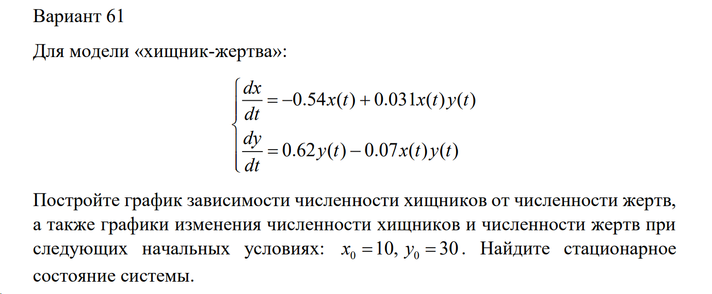
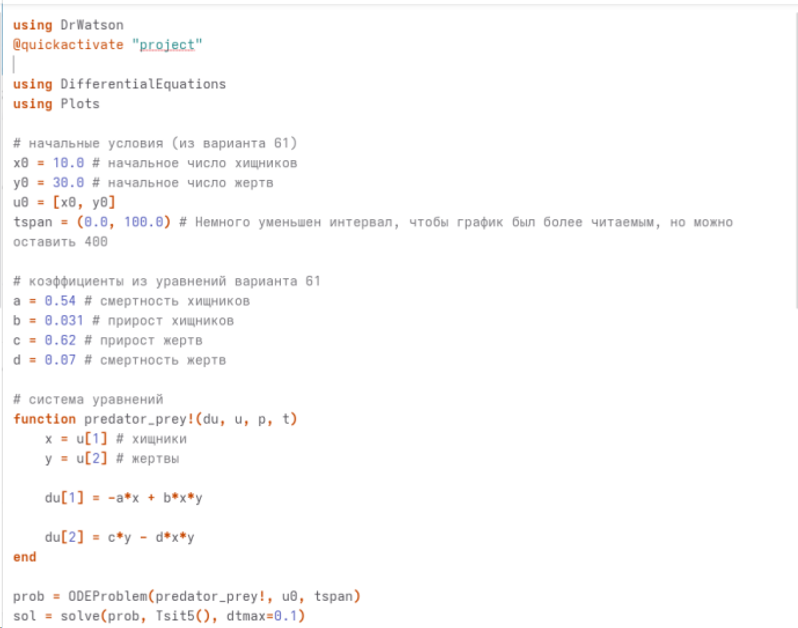
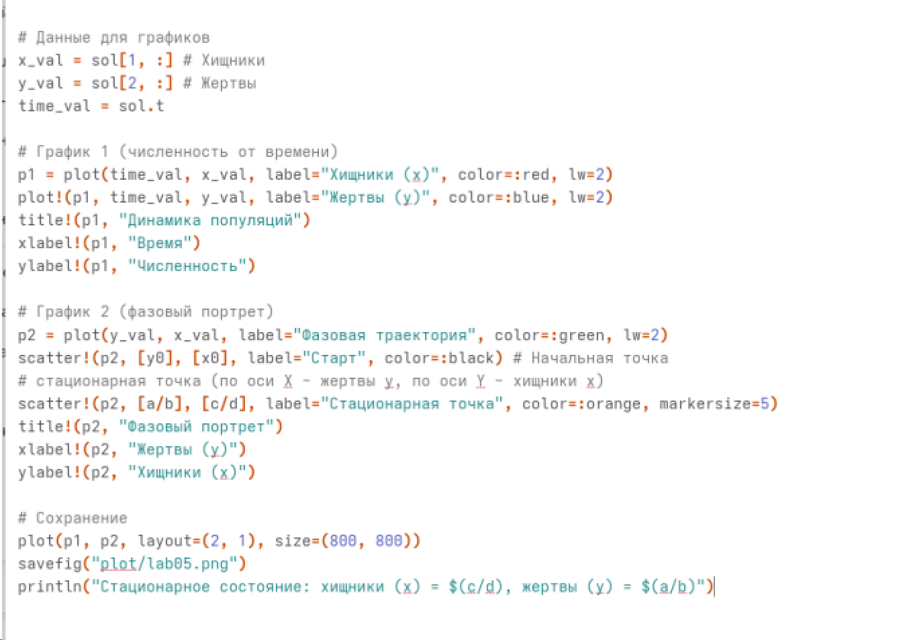
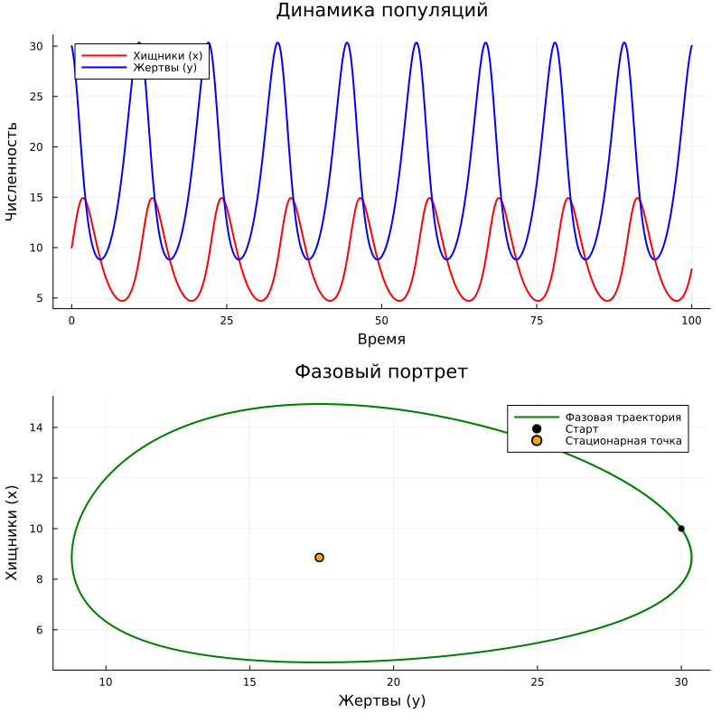
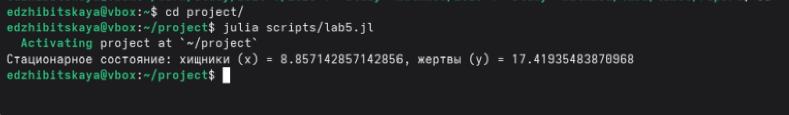

---
## Author
author:
  name: Жибицкая Евгения Дмитриевна
  degrees: 
  orcid: 
  email: 1132236130@rudn.ru
  affiliation:
    - name: Российский университет дружбы народов
      country: Российская Федерация
      postal-code: 117198
      city: Москва
      address: ул. Миклухо-Маклая, д. 6
## Title
title: Лабораторная №5
subtitle: Математическое моделирование
license: CC BY
date: today

---

# Цель работы

## Цель

- Построение простейшей модели взаимодействия двух видов типа «хищник — жертва» - модели Лотки-Вольтерры. Решение задачи с помощью моделирования, построение графиков

# Выполнение лабораторной работы

## Подготовка
:::::::::::::: {.columns align=center}
::: {.column width="50%"}

Перед выполнением лабораторной работы необходимо определить номер варианта для решения задачи
:::
::: {.column width="40%"}

:::
::::::::::::::

## Вариант 61
:::::::::::::: {.columns align=center}
::: {.column width="50%"}

:::
::::::::::::::

## Вариант 61. Анализ условия

:::::::::::::: {.columns align=center}
::: {.column width="50%"}

В данной лабораторной работе рассматривается простейшая математическая модель взаимодействия двух видов типа «хищник — жертва» — модель Лотки-Вольтерры.

Пусть $x(t)$ — численность популяции хищников (волков), а $y(t)$ — численность популяции жертв (зайцев) в момент времени $t$. 

Динамика изменения численности популяций описывается следующей системой обыкновенных дифференциальных уравнений:
:::
::: {.column width="50%"}

$$
\begin{cases}
\frac{dx}{dt} = -a x(t) + b x(t)y(t) \\
\frac{dy}{dt} = c y(t) - d x(t)y(t)
\end{cases}
$$

:::
::::::::::::::

## Физический смысл
* $\frac{dx}{dt}$ и $\frac{dy}{dt}$ — скорости изменения численности волков и зайцев соответственно.
* Слагаемое $-ax(t)$ описывает естественную убыль популяции хищников (смертность от старости и болезней) в отсутствие пищи. Знак минус указывает на уменьшение популяции. $a$ — коэффициент смертности хищников.
* Слагаемое $cy(t)$ описывает естественный прирост популяции жертв в условиях неограниченного ресурса (травы) и в отсутствие хищников. $c$ — коэффициент прироста жертв.
* Произведение $x(t)y(t)$ пропорционально частоте встреч хищников и жертв. 
* Слагаемое $-dx(t)y(t)$ показывает убыль популяции зайцев за счет того, что их съедают волки. $d$ — коэффициент смертности жертв.
* Слагаемое $+bx(t)y(t)$ показывает прирост популяции волков за счет поглощенной пищи. $b$ — коэффициент прироста хищников.

##  Стационарное состояние системы

По заданию необходимо найти стационарное состояние системы —  состояние, при котором численность обеих популяций остается неизменной во времени. Это означает, что скорости изменения популяций равны нулю: $\frac{dx}{dt} = 0$ и $\frac{dy}{dt} = 0$.

Координаты стационарной точки: 

$$ x_0 = \frac{c}{d}, \quad y_0 = \frac{a}{b} $$

Если в начальный момент времени задать численность хищников и жертв равной этим значениям, система будет находиться в равновесии бесконечно долго. Любое отклонение от этой точки приведет к возникновению периодических колебаний численности.

## Задача

Для численного моделирования и построения фазового портрета необходимо решить систему дифференциальных уравнений, задав начальные численности популяций в момент времени $t=0$:
$$
\begin{cases}
x(0) = x_0 \\
y(0) = y_0
\end{cases}
$$
Решение данной системы позволяет построить графики зависимостей $x(t)$ и $y(t)$, а также фазовый портрет системы — график зависимости численности хищников от численности жертв $x(y)$, который в модели Лотки-Вольтерры представляет собой замкнутую кривую.

## Программная реализация

:::::::::::::: {.columns align=center}
::: {.column width="40%"}

:::
::: {.column width="40%"}

:::
::::::::::::::

## Графики 

:::::::::::::: {.columns align=center}
::: {.column width="50%"}

:::
::: {.column width="50%"}

:::
::::::::::::::

# Выводы

## Вывод

- В ходе работы была построена простейшая модель взаимодействия двух видов типа «хищник — жертва» - модель Лотки-Вольтерры. Была решена задачи с помощью моделирования, построен фазовый портрет
