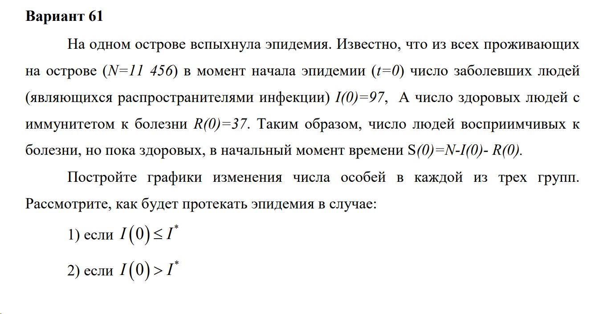
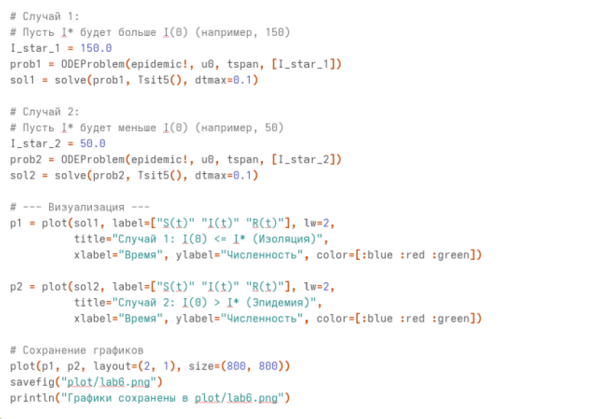

---
## Author
author:
  name: Жибицкая Евгения Дмитриевна
  degrees: 
  orcid: 
  email: 1132236130@rudn.ru
  affiliation:
    - name: Российский университет дружбы народов
      country: Российская Федерация
      postal-code: 117198
      city: Москва
      address: ул. Миклухо-Маклая, д. 6
## Title
title: Лабораторная №6
subtitle: Математическое моделирование
license: CC BY
date: today

---

# Цель работы

## Цель

- Построение модели для задачи об эпидемии.  Решение задачи с помощью моделирования, построение графиков изменения числа особей.

# Выполнение лабораторной работы

## Подготовка
:::::::::::::: {.columns align=center}
::: {.column width="50%"}

Перед выполнением лабораторной работы необходимо определить номер варианта для решения задачи
:::
::: {.column width="40%"}

:::
::::::::::::::

## Вариант 61
:::::::::::::: {.columns align=center}
::: {.column width="50%"}

:::
::::::::::::::

## Вариант 61. Анализ условия

В данной лабораторной работе рассматривается простейшая математическая модель развития эпидемии (модель SIR). 

Предполагается, что изолированная популяция численностью $N$ разбита на три непересекающиеся группы:

* $S(t)$ — восприимчивые к болезни, но пока здоровые особи;

* $I(t)$ — инфицированные особи, являющиеся распространителями инфекции;

* $R(t)$ — здоровые особи, переболевшие и приобретшие иммунитет к болезни.

## Анализ условия

Согласно условиям варианта 61, общая численность популяции составляет $N = 11456$ человек. 
В начальный момент времени ($t = 0$) известно:

* Число заболевших: $I(0) = 97$;

* Число людей с иммунитетом: $R(0) = 37$;

* Число восприимчивых к болезни людей: $S(0) = N - I(0) - R(0) = 11456 - 97 - 37 = 11322$.

Динамика изменения численности каждой из групп описывается системой дифференциальных уравнений, зависящей от того, превышает ли число больных некоторое критическое значение $I^*$. 

##  Случай 1

Число инфицированных не превышает критического порога ($I(t) \le I^*$)
В этом случае предполагается, что санитарно-эпидемиологические службы успешно изолируют всех больных. Инфицированные не контактируют со здоровыми, поэтому новые заражения не происходят. 

Скорость изменения числа восприимчивых равна нулю, а инфицированные со временем просто переходят в группу выздоровевших:
$$
\begin{cases}
\frac{dS}{dt} = 0 \\
\frac{dI}{dt} = -\beta I(t) \\
\frac{dR}{dt} = \beta I(t)
\end{cases}
$$
Где $\beta$ — коэффициент выздоровления, характеризующий скорость протекания болезни.

## Случай 2

 Число инфицированных превышает критический порог ($I(t) > I^*$)
В данном случае изоляция становится неэффективной, и инфицированные особи свободно контактируют со здоровыми, передавая им инфекцию. Скорость убывания здоровых особей становится пропорциональна их собственному количеству (согласно упрощенной модели из методических указаний).

Система дифференциальных уравнений принимает вид:
$$
\begin{cases}
\frac{dS}{dt} = -\alpha S(t) \\
\frac{dI}{dt} = \alpha S(t) - \beta I(t) \\
\frac{dR}{dt} = \beta I(t)
\end{cases}
$$
Где $\alpha$ — коэффициент заболеваемости.
Второе уравнение показывает, что скорость изменения числа больных ($dI/dt$) зависит от баланса: сколько новых людей заразилось ($\alpha S$) минус сколь

## Задача

Для построения графиков протекания эпидемии в обоих случаях решаются системы дифференциальных уравнений с одинаковыми начальными условиями:

$$
\begin{cases}
S(0) = 11322 \\
I(0) = 97 \\
R(0) = 37
\end{cases}
$$

Важным свойством данной математической модели является закон сохранения численности популяции: 
$$ \frac{dS}{dt} + \frac{dI}{dt} + \frac{dR}{dt} = 0 \implies S(t) + I(t) + R(t) = N = const $$
Это подтверждает закрытость модели (отсутствие естественной демографии и миграции на острове).

## Программная реализация

:::::::::::::: {.columns align=center}
::: {.column width="40%"}

:::
::: {.column width="40%"}

:::
::::::::::::::

## Графики 
:::::::::::::: {.columns align=center}
::: {.column width="50%"}

:::
::::::::::::::

# Выводы

## Вывод

- В ходе работы была построена модель для задачи об эпидемии. Задача решена с помощью моделирования, построения графиков изменения числа особей 
