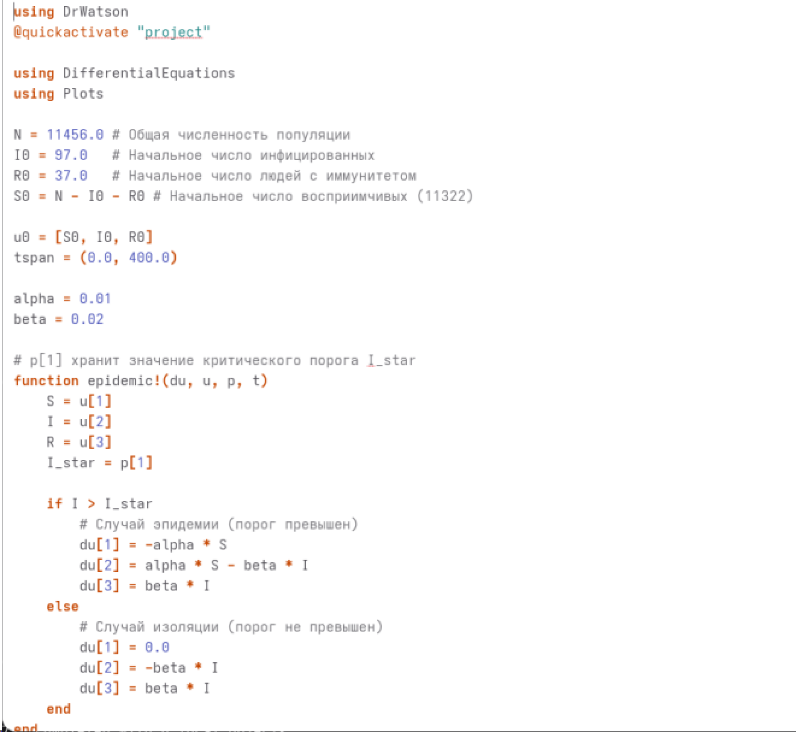
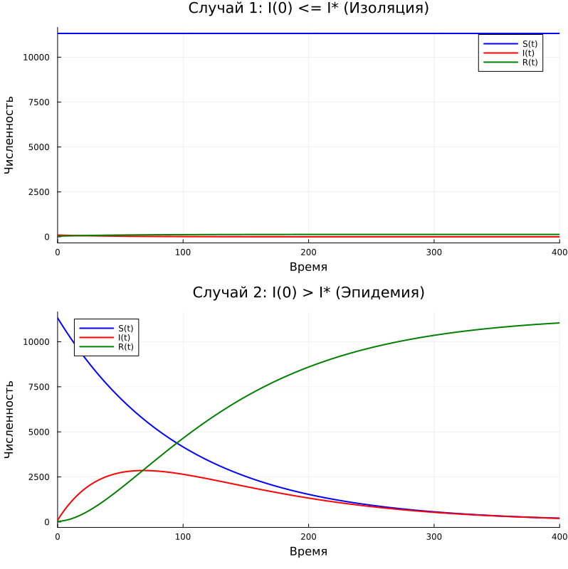

---
## Author
author:
  name: Жибицкая Евгения Дмитриевна
  degrees: 
  orcid: 0000-0002-0877-7063
  email: 1132236130@rudn.ru
  affiliation:
    - name: Российский университет дружбы народов
      country: Российская Федерация
      postal-code: 117198
      city: Москва
      address: ул. Миклухо-Маклая, д. 6

## Title
title: "Лабораторная работа №6"
subtitle: "Дисциплина: Математическое моделирование"
license: "CC BY"
---

# Цель работы

Построение модели для задачи об эпидемии.  Решение задачи с помощью моделирования, построение графиков изменения числа особей.

# Выполнение лабораторной работы

Перед выполнением лабораторной работы необходимо определить номер варианта для решения задачи. Сделаем это (рис. [-@fig-001]).

{#fig-001 width=70%}

{#fig-002 width=70%}

## Математическая модель

В данной лабораторной работе рассматривается простейшая математическая модель развития эпидемии (модель SIR). 

Предполагается, что изолированная популяция численностью $N$ разбита на три непересекающиеся группы:
* $S(t)$ — восприимчивые к болезни, но пока здоровые особи;
* $I(t)$ — инфицированные особи, являющиеся распространителями инфекции;
* $R(t)$ — здоровые особи, переболевшие и приобретшие иммунитет к болезни.

Согласно условиям варианта 61, общая численность популяции составляет $N = 11456$ человек. 
В начальный момент времени ($t = 0$) известно:
* Число заболевших: $I(0) = 97$;
* Число людей с иммунитетом: $R(0) = 37$;
* Число восприимчивых к болезни людей: $S(0) = N - I(0) - R(0) = 11456 - 97 - 37 = 11322$.

Динамика изменения численности каждой из групп описывается системой дифференциальных уравнений, зависящей от того, превышает ли число больных некоторое критическое значение $I^*$. 

**Случай 1:** Число инфицированных не превышает критического порога ($I(t) \le I^*$)
В этом случае предполагается, что санитарно-эпидемиологические службы успешно изолируют всех больных. Инфицированные не контактируют со здоровыми, поэтому новые заражения не происходят. 

Скорость изменения числа восприимчивых равна нулю, а инфицированные со временем просто переходят в группу выздоровевших:
$$
\begin{cases}
\frac{dS}{dt} = 0 \\
\frac{dI}{dt} = -\beta I(t) \\
\frac{dR}{dt} = \beta I(t)
\end{cases}
$$
Где $\beta$ — коэффициент выздоровления, характеризующий скорость протекания болезни.

** Случай 2:** Число инфицированных превышает критический порог ($I(t) > I^*$)
В данном случае изоляция становится неэффективной, и инфицированные особи свободно контактируют со здоровыми, передавая им инфекцию. Скорость убывания здоровых особей становится пропорциональна их собственному количеству (согласно упрощенной модели из методических указаний).

Система дифференциальных уравнений принимает вид:
$$
\begin{cases}
\frac{dS}{dt} = -\alpha S(t) \\
\frac{dI}{dt} = \alpha S(t) - \beta I(t) \\
\frac{dR}{dt} = \beta I(t)
\end{cases}
$$
Где $\alpha$ — коэффициент заболеваемости.
Второе уравнение показывает, что скорость изменения числа больных ($dI/dt$) зависит от баланса: сколько новых людей заразилось ($\alpha S$) минус сколько людей выздоровело ($\beta I$).

Постановка задачи Коши

Для построения графиков протекания эпидемии в обоих случаях решаются системы дифференциальных уравнений с одинаковыми начальными условиями:

$$
\begin{cases}
S(0) = 11322 \\
I(0) = 97 \\
R(0) = 37
\end{cases}
$$

Важным свойством данной математической модели является закон сохранения численности популяции: 
$$ \frac{dS}{dt} + \frac{dI}{dt} + \frac{dR}{dt} = 0 \implies S(t) + I(t) + R(t) = N = const $$
Это подтверждает закрытость модели (отсутствие естественной демографии и миграции на острове).

## Программная реализация

Реализуем код на Julia.

```
using DrWatson
@quickactivate "project" 

using DifferentialEquations
using Plots

N = 11456.0 
I0 = 97.0   
R0 = 37.0   
S0 = N - I0 - R0  

u0 = [S0, I0, R0]
tspan = (0.0, 400.0)

alpha = 0.01
beta = 0.02


function epidemic!(du, u, p, t)
    S = u[1]
    I = u[2]
    R = u[3]
    I_star = p[1]
    
    if I > I_star
        
        du[1] = -alpha * S
        du[2] = alpha * S - beta * I
        du[3] = beta * I
    else
        
        du[1] = 0.0
        du[2] = -beta * I
        du[3] = beta * I
    end
end

#  1:
# 
I_star_1 = 150.0 
prob1 = ODEProblem(epidemic!, u0, tspan, [I_star_1])
sol1 = solve(prob1, Tsit5(), dtmax=0.1)

#  2:
# 
I_star_2 = 50.0
prob2 = ODEProblem(epidemic!, u0, tspan, [I_star_2])
sol2 = solve(prob2, Tsit5(), dtmax=0.1)


p1 = plot(sol1, label=["S(t)" "I(t)" "R(t)"], lw=2,
          title="Случай 1: I(0) <= I* (Изоляция)",
          xlabel="Время", ylabel="Численность", color=[:blue :red :green])

p2 = plot(sol2, label=["S(t)" "I(t)" "R(t)"], lw=2,
          title="Случай 2: I(0) > I* (Эпидемия)",
          xlabel="Время", ylabel="Численность", color=[:blue :red :green])

plot(p1, p2, layout=(2, 1), size=(800, 800))
savefig("plot/lab6.png")
println("Графики сохранены в plot/lab6.png")
```


Реализация кода ([рис. @fig-003] и [рис. @fig-004]).


{#fig-003 width=70%}

{#fig-004 width=70%}


```
model SIR_Epidemic
  parameter Real N = 11456.0;
  parameter Real I0 = 97.0;
  parameter Real R0 = 37.0;
  parameter Real S0 = N - I0 - R0;
  
  parameter Real alpha = 0.01;
  parameter Real beta = 0.02;
  parameter Real I_star_1 = 150.0;
  parameter Real I_star_2 = 50.0;
  
  Real S1(start = S0);
  Real I1(start = I0);
  Real R1(start = R0);
  
  Real S2(start = S0);
  Real I2(start = I0);
  Real R2(start = R0);
equation
  if I1 > I_star_1 then
    der(S1) = -alpha * S1;
    der(I1) = alpha * S1 - beta * I1;
    der(R1) = beta * I1;
  else
    der(S1) = 0.0;
    der(I1) = -beta * I1;
    der(R1) = beta * I1;
  end if;
  
  if I2 > I_star_2 then
    der(S2) = -alpha * S2;
    der(I2) = alpha * S2 - beta * I2;
    der(R2) = beta * I2;
  else
    der(S2) = 0.0;
    der(I2) = -beta * I2;
    der(R2) = beta * I2;
  end if;
end SIR_Epidemic;
```


Построенные модели([рис. @fig-005]).

{#fig-005 width=70%}


# Выводы

В ходе работы была построена модель для задачи об эпидемии. Задача решена с помощью моделирования, построения графиков изменения числа особей.


# Список литературы{.unnumbered}

[ТУИС](https://esystem.rudn.ru/pluginfile.php/3094843/mod_resource/content/2/Лабораторная%20работа%20№%205.pdf)

::: {#refs}
:::
