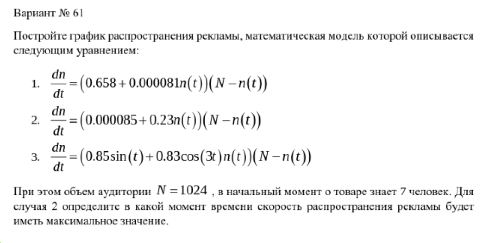
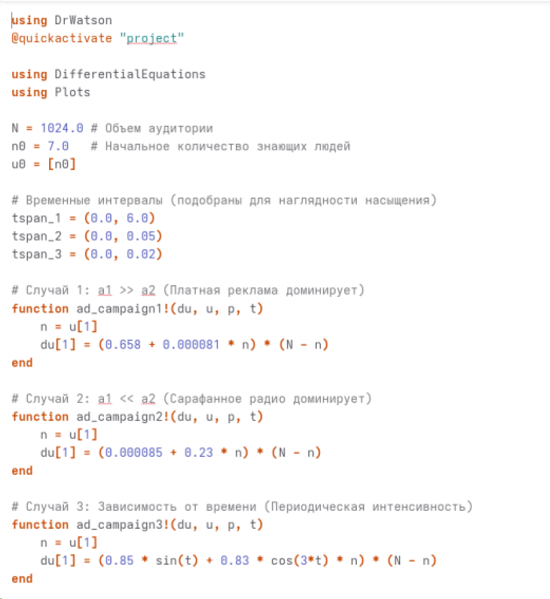
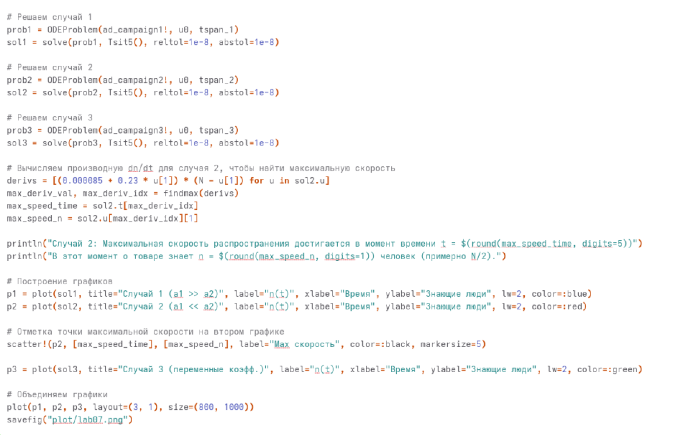
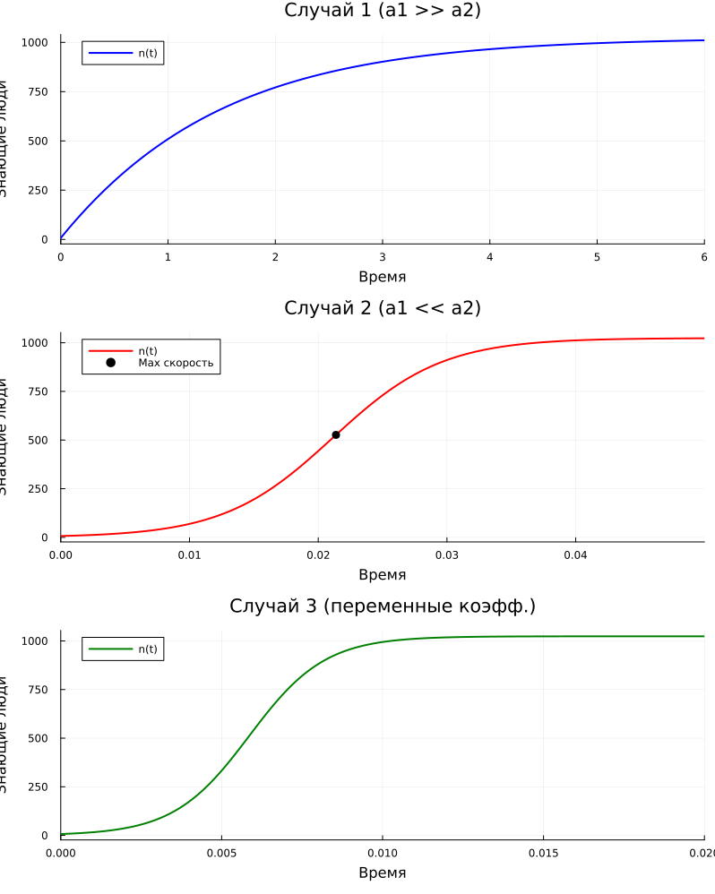
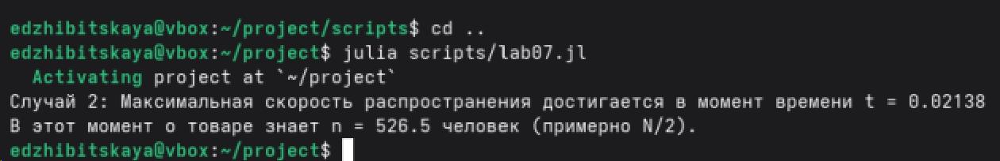

---
## Author
author:
  name: Жибицкая Евгения Дмитриевна
  degrees: 
  orcid: 0000-0002-0877-7063
  email: 1132236130@rudn.ru
  affiliation:
    - name: Российский университет дружбы народов
      country: Российская Федерация
      postal-code: 117198
      city: Москва
      address: ул. Миклухо-Маклая, д. 6

## Title
title: "Лабораторная работа №7"
subtitle: "Дисциплина: Математическое моделирование"
license: "CC BY"
---

# Цель работы

Построение модели для задачи об эффективности рекламы.  Решение задачи с помощью моделирования, построение графиков распространения рекламы, сравнение рекламных кампаний.

# Выполнение лабораторной работы

Перед выполнением лабораторной работы необходимо определить номер варианта для решения задачи. Сделаем это (рис. [-@fig-001]).

{#fig-001 width=70%}

{#fig-002 width=70%}

## Математическая модель

В данной лабораторной работе рассматривается математическая модель распространения рекламы. 

Пусть $N$ — общее число потенциальных платежеспособных покупателей, которых может заинтересовать предлагаемый товар (в нашем случае — услуги салона красоты). 
Обозначим через $n(t)$ число людей, уже знающих о товаре в момент времени $t$. 
Тогда число людей, еще не знающих о товаре, равно $(N - n(t))$.

Скорость изменения числа информированных клиентов $\frac{dn}{dt}$ складывается из двух факторов:
1. **Платная рекламная кампания.** Информация распространяется через СМИ (радио, телевидение). Вклад этого фактора пропорционален числу людей, еще не знающих о товаре: $\alpha_1(t)(N - n(t))$, где $\alpha_1(t)$ — интенсивность платной рекламы.
2. **«Сарафанное радио».** Информация передается при личном общении от тех, кто уже знает о товаре, к тем, кто еще не знает. Вклад этого фактора пропорционален как числу информированных, так и числу неинформированных клиентов: $\alpha_2(t)n(t)(N - n(t))$, где $\alpha_2(t)$ — степень эффективности общения покупателей.

Объединяя оба фактора, получаем дифференциальное уравнение модели:
$$ \frac{dn}{dt} = \left( \alpha_1(t) + \alpha_2(t)n(t) \right) (N - n(t)) $$

### Анализ коэффициентов модели
Характер протекания рекламной кампании (форма графика функции $n(t)$) сильно зависит от соотношения коэффициентов $\alpha_1(t)$ и $\alpha_2(t)$:

* **Случай 1: $\alpha_1(t) \gg \alpha_2(t)$ (Доминирование платной рекламы)**
В этом случае влияние сарафанного радио пренебрежимо мало. Уравнение упрощается до $\frac{dn}{dt} = \alpha_1(t)(N - n(t))$. Такое уравнение описывает рост, который начинается с максимальной скорости и постепенно замедляется по мере истощения целевой аудитории, асимптотически приближаясь к $N$ (модель типа модели Мальтуса с ограничителем).

* **Случай 2: $\alpha_1(t) \ll \alpha_2(t)$ (Доминирование сарафанного радио)**
Здесь основную роль играют межличностные коммуникации. График решения представляет собой логистическую (S-образную) кривую. На начальном этапе рост медленный (так как $n(t)$ мало), затем следует фаза экспоненциального (взрывного) роста, и, наконец, замедление при насыщении рынка. Точка максимальной скорости распространения рекламы находится в точке перегиба функции (при $n(t) \approx N/2$).

### Постановка задачи 
Для численного моделирования процесса распространения рекламы необходимо решить приведенное дифференциальное уравнение первого порядка с начальным условием:
$$ n(t_0) = N_0 $$
где $N_0$ — количество потенциальных клиентов, знавших о салоне в момент его открытия ($t_0 = 0$).

Согласно условиям варианта, моделирование проводится для трех случаев:
1. $\alpha_1(t) > \alpha_2(t)$ (коэффициенты постоянны);
2. $\alpha_1(t) < \alpha_2(t)$ (коэффициенты постоянны);
3. Коэффициенты $\alpha_1(t)$ и $\alpha_2(t)$ являются функциями, зависящими от времени $t$ (например, линейными или гармоническими), что имитирует изменение рекламного бюджета или сезонный интерес покупателей.


## Программная реализация

Реализуем код на Julia.

```
using DrWatson
@quickactivate "project"

using DifferentialEquations
using Plots

N = 1024.0 
n0 = 7.0   
u0 = [n0]


tspan_1 = (0.0, 6.0) 
tspan_2 = (0.0, 0.05) 
tspan_3 = (0.0, 0.02) 

# 1: a1 >> a2
function ad_campaign1!(du, u, p, t)
    n = u[1]
    du[1] = (0.658 + 0.000081 * n) * (N - n)
end

# 2: a1 << a2 
function ad_campaign2!(du, u, p, t)
    n = u[1]
    du[1] = (0.000085 + 0.23 * n) * (N - n)
end

#  3
function ad_campaign3!(du, u, p, t)
    n = u[1]
    du[1] = (0.85 * sin(t) + 0.83 * cos(3*t) * n) * (N - n)
end

#  1
prob1 = ODEProblem(ad_campaign1!, u0, tspan_1)
sol1 = solve(prob1, Tsit5(), reltol=1e-8, abstol=1e-8)

# 2
prob2 = ODEProblem(ad_campaign2!, u0, tspan_2)
sol2 = solve(prob2, Tsit5(), reltol=1e-8, abstol=1e-8)

# 3
prob3 = ODEProblem(ad_campaign3!, u0, tspan_3)
sol3 = solve(prob3, Tsit5(), reltol=1e-8, abstol=1e-8)

derivs = [(0.000085 + 0.23 * u[1]) * (N - u[1]) for u in sol2.u]  
max_deriv_val, max_deriv_idx = findmax(derivs)
max_speed_time = sol2.t[max_deriv_idx]
max_speed_n = sol2.u[max_deriv_idx][1]

println("Случай 2: Максимальная скорость распространения достигается в момент времени t = $(round(max_speed_time, digits=5))")
println("В этот момент о товаре знает n = $(round(max_speed_n, digits=1)) человек (примерно N/2).")

p1 = plot(sol1, title="Случай 1 (a1 >> a2)", label="n(t)", xlabel="Время", ylabel="Знающие люди", lw=2, color=:blue)
p2 = plot(sol2, title="Случай 2 (a1 << a2)", label="n(t)", xlabel="Время", ylabel="Знающие люди", lw=2, color=:red)


scatter!(p2, [max_speed_time], [max_speed_n], label="Max скорость", color=:black, markersize=5)

p3 = plot(sol3, title="Случай 3 (переменные коэфф.)", label="n(t)", xlabel="Время", ylabel="Знающие люди", lw=2, color=:green)

plot(p1, p2, p3, layout=(3, 1), size=(800, 1000))
savefig("plot/lab07.png")
```


Реализация кода ([рис. @fig-003] и [рис. @fig-004]).


{#fig-003 width=70%}

{#fig-004 width=70%}


```
model Advertising1
  parameter Real N = 1024.0;
  parameter Real n0 = 7.0;
  Real n(start = n0);
equation
  der(n) = (0.658 + 0.000081 * n) * (N - n);
  annotation(experiment(StopTime = 6.0, Interval = 0.01));
end Advertising1;

model Advertising2
  parameter Real N = 1024.0;
  parameter Real n0 = 7.0;
  Real n(start = n0);
  Real dn;
equation
  dn = (0.000085 + 0.23 * n) * (N - n);
  der(n) = dn;
  annotation(experiment(StopTime = 0.05, Interval = 0.0001));
end Advertising2;

model Advertising3
  parameter Real N = 1024.0;
  parameter Real n0 = 7.0;
  Real n(start = n0);
equation
  der(n) = (0.85 * sin(time) + 0.83 * cos(3 * time) * n) * (N - n);
  annotation(experiment(StopTime = 0.02, Interval = 0.0001));
end Advertising3;
```


Построенные модели([рис. @fig-005]) и результат([рис. @fig-006]).

{#fig-005 width=70%}

{#fig-006 width=70%}


## Ответы на вопросы

 1. Записать модель Мальтуса (дать пояснение, где используется данная модель)

**Уравнение:**
В классическом виде: $\frac{dx}{dt} = k \cdot x$, где $k$ — коэффициент прироста.
Применительно к задаче о рекламе (с учетом ограничения аудитории): $\frac{dn}{dt} = \alpha_1(t) \cdot (N - n(t))$

**Пояснение:**
Модель Мальтуса описывает экспоненциальный рост (или убыль) популяции, при котором скорость роста пропорциональна текущему количеству.
**Где используется:**
* В биологии — для описания размножения бактерий в идеальных условиях (когда еды бесконечно много).
* В физике — для описания радиоактивного распада.
* **В экономике/рекламе** — она описывает ситуацию, когда информация распространяется *только через платные каналы* (СМИ). Скорость оповещения зависит только от бюджета (интенсивности рекламы) и количества людей, которые еще не охвачены.

 2. Записать уравнение логистической кривой (дать пояснение, что описывает данное уравнение)

**Уравнение:**
В классическом виде (уравнение Ферхюльста): $\frac{dx}{dt} = r \cdot x \cdot \left(1 - \frac{x}{K}\right)$
Применительно к задаче о рекламе: $\frac{dn}{dt} = \alpha_2(t) \cdot n(t) \cdot (N - n(t))$

**Пояснение:**
Логистическая кривая описывает рост популяции в условиях **ограниченных ресурсов**.
Вначале рост происходит быстро (почти по экспоненте), но по мере приближения к «потолку» (предельной емкости среды $K$, или максимальной аудитории $N$) скорость роста падает до нуля. График имеет характерную **S-образную форму** с точкой перегиба посередине.

 3. На что влияет коэффициент $\alpha_1(t)$ и $\alpha_2(t)$ в модели распространения рекламы
*   **$\alpha_1(t)$** — это коэффициент интенсивности **платной рекламы** (ТВ, радио, билборды). Он определяет, как быстро люди узнают о товаре напрямую от самого продавца. Чем больше рекламный бюджет, тем выше этот коэффициент.
*   **$\alpha_2(t)$** — это коэффициент эффективности **«сарафанного радио»** (межличностного общения). Он определяет, с какой вероятностью человек, который уже знает о товаре, расскажет о нем тому, кто еще не знает. Зависит от того, насколько товар "вирусный" или интересный для обсуждения.

 4. Как ведет себя рассматриваемая модель при $\alpha_1(t) \gg \alpha_2(t)$
Если платная реклама значительно превосходит сарафанное радио, слагаемым с $\alpha_2$ можно пренебречь. Модель сводится к уравнению $\frac{dn}{dt} \approx \alpha_1(N - n)$.

**Поведение модели:** 
Скорость распространения рекламы **максимальна в самый начальный момент времени**, потому что неохваченная аудитория ($N-n$) огромна, и платная реклама бьет сразу по всем. Затем скорость плавно затухает по мере того, как все больше людей узнают о товаре. График выпуклый вверх и не имеет S-образной формы.

 5. Как ведет себя рассматриваемая модель при $\alpha_1(t) \ll \alpha_2(t)$
Если сарафанное радио доминирует над платной рекламой (например, бюджет на рекламу крошечный, но товар — хит), платная реклама играет лишь роль "первой искры", чтобы появились первые знающие. Модель сводится к логистическому уравнению $\frac{dn}{dt} \approx \alpha_2 n(N - n)$.

**Поведение модели:**
График принимает **S-образную форму**. 
* Вначале рост очень медленный (знает мало людей, некому рассказывать). 
* Затем происходит взрывной (экспоненциальный) рост. 
* **Максимальная скорость** достигается в точке перегиба графика, когда о товаре знает ровно **половина аудитории** ($n = N/2$). 
* После этого скорость начинает падать, так как знающим людям становится все труднее найти тех, кто еще не в курсе.


# Выводы

В ходе работы была построена модель для задачи об эффективности рекламы.  Было произведено решение задачи с помощью моделирования, построены графики распространения рекламы, проведен анализ рекламных кампаний на основе полученных данных.


# Список литературы{.unnumbered}

[ТУИС](https://esystem.rudn.ru/pluginfile.php/3094847/mod_resource/content/2/%D0%9B%D0%B0%D0%B1%D0%BE%D1%80%D0%B0%D1%82%D0%BE%D1%80%D0%BD%D0%B0%D1%8F%20%D1%80%D0%B0%D0%B1%D0%BE%D1%82%D0%B0%20%E2%84%96%206.pdf)

::: {#refs}
:::
