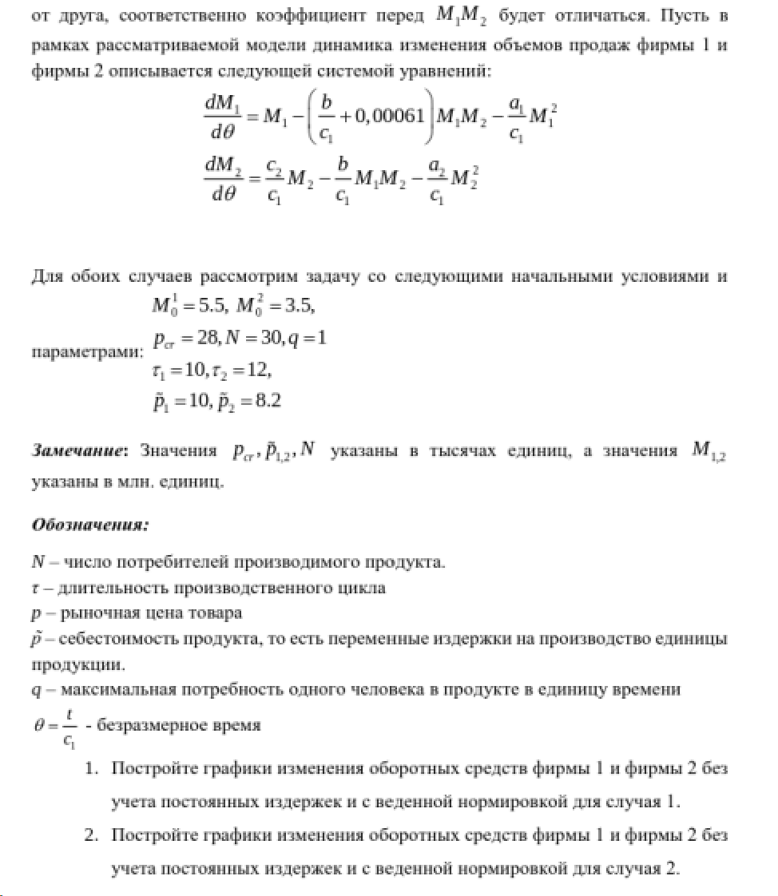
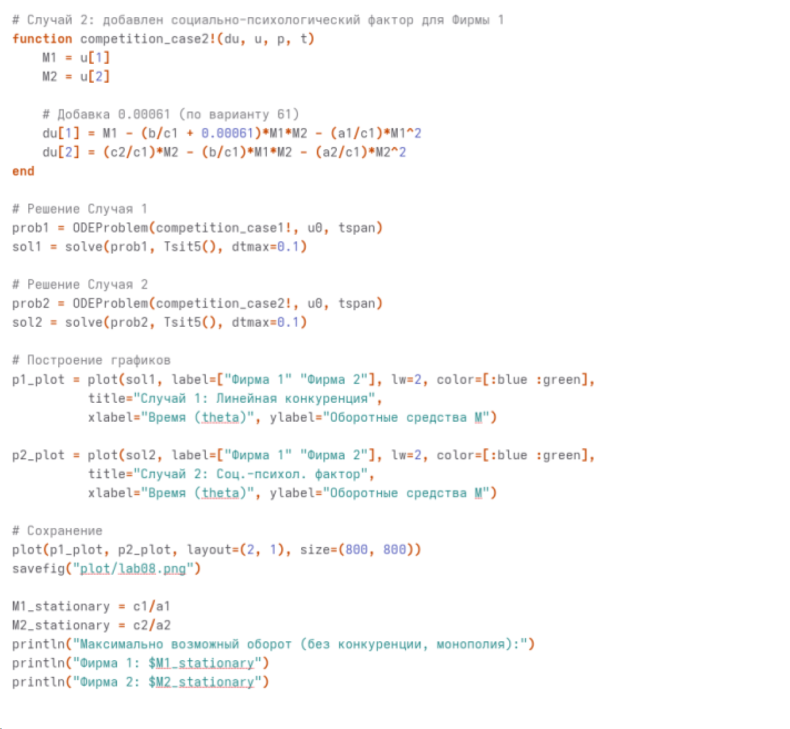

---
## Author
author:
  name: Жибицкая Евгения Дмитриевна
  degrees: 
  orcid: 
  email: 1132236130@rudn.ru
  affiliation:
    - name: Российский университет дружбы народов
      country: Российская Федерация
      postal-code: 117198
      city: Москва
      address: ул. Миклухо-Маклая, д. 6
## Title
title: Лабораторная №8
subtitle: Математическое моделирование
license: CC BY
date: today

---

# Цель работы

## Цель

- Построение модели конкуренции двух фирм.  Решение задачи с помощью моделирования, построение графиков изменения объемов оборотных средств каждой фирмы

# Выполнение лабораторной работы

## Подготовка
:::::::::::::: {.columns align=center}
::: {.column width="50%"}

Перед выполнением лабораторной работы необходимо определить номер варианта для решения задачи
:::
::: {.column width="35%"}

:::
::::::::::::::

## Вариант 61
:::::::::::::: {.columns align=center}
::: {.column width="40%"}

:::
::: {.column width="40%"}

:::
::::::::::::::

## Вариант 61. Анализ условия

В данной лабораторной работе рассматривается модель конкуренции двух фирм, производящих взаимозаменяемые товары одинакового качества и находящихся в одной рыночной нише. Считается, что у потребителей нет априорных предпочтений, и товар реализуется по единой рыночной цене $p$, зависящей от баланса спроса и предложения.

Главной переменной модели выступают оборотные средства предприятий $M_1$ и $M_2$.

Используются  коэффициенты, зависящие от параметров производства:

 $p_{cr}$ — критическая стоимость продукта
 
 $N$ — число потребителей, $q$ — максимальная потребность одного человека
 
 $\tau$ — длительность производственного цикла, $\tilde{p}$ — себестоимость.

Для упрощения решения вводится безразмерное время $\theta = \frac{t}{c_1}$

## Случай 1

В первом случае конкурентная борьба ведется исключительно экономическими методами. Коэффициент конкурентного давления (пересечение интересов фирм) симметричен и равен $\frac{b}{c_1}$. Система дифференциальных уравнений имеет вид:

$$
\begin{cases}
\frac{dM_1}{d\theta} = M_1 - \frac{b}{c_1}M_1 M_2 - \frac{a_1}{c_1}M_1^2 \\
\frac{dM_2}{d\theta} = \frac{c_2}{c_1}M_2 - \frac{b}{c_1}M_1 M_2 - \frac{a_2}{c_1}M_2^2
\end{cases}
$$

Графики решения данной системы демонстрируют, что обе фирмы, несмотря на конкуренцию, достигают своих максимальных значений объема продаж и закрепляются на рынке. Банкротства не происходит.

##  Случай 1

Стационарное состояние системы — это состояние, при котором объемы оборотных средств фирм не изменяются. Математически это означает, что производные равны нулю: $\frac{dM_1}{d\theta} = 0$ и $\frac{dM_2}{d\theta} = 0$.

Исключая решение $M_1=0, M_2=0$ (фирмы отсутствуют на рынке), разделим первое уравнение на $M_1$, а второе на $M_2$:
$$
\begin{cases}
1 - \frac{b}{c_1}M_2 - \frac{a_1}{c_1}M_1 = 0 \\
\frac{c_2}{c_1} - \frac{b}{c_1}M_1 - \frac{a_2}{c_1}M_2 = 0
\end{cases}
$$

Решая систему относительно $M_1$ и $M_2$, получаем координаты стационарной точки:

$$ M_1^* = \frac{c_1 a_2 - c_2 b}{a_1 a_2 - b^2} $$
$$ M_2^* = \frac{a_1 c_2 - b c_1}{a_1 a_2 - b^2} $$

Именно к этим значениям асимптотически стремятся графики оборотных средств обеих фирм в первом случае.

## Случай 2

Во втором случае в модель вводится дополнительный фактор нечестной конкуренции (или формирование общественного предпочтения одного бренда другому, не зависящее от качества). В результате этого симметрия нарушается, и в уравнении первой фирмы коэффициент перед произведением $M_1 M_2$ изменяется (например, увеличивается на величину $\Delta$).

Система принимает вид:
$$
\begin{cases}
\frac{dM_1}{d\theta} = M_1 - \left(\frac{b}{c_1} + \Delta\right) M_1 M_2 - \frac{a_1}{c_1}M_1^2 \\
\frac{dM_2}{d\theta} = \frac{c_2}{c_1}M_2 - \frac{b}{c_1}M_1 M_2 - \frac{a_2}{c_1}M_2^2
\end{cases}
$$

Появление дополнительного фактора приводит к тому, что первая фирма (в отношении которой действует негативный социально-психологический фактор) начинает нести убытки после первоначального роста. В конечном итоге ее оборотные средства падают до нуля ($M_1 \to 0$), фирма терпит банкротство, а вторая фирма захватывает весь рынок.

## Программная реализация

:::::::::::::: {.columns align=center}
::: {.column width="40%"}

:::
::: {.column width="40%"}

:::
::::::::::::::

## Графики 
:::::::::::::: {.columns align=center}
::: {.column width="50%"}

:::
::: {.column width="50%"}

:::
::::::::::::::

# Выводы

## Вывод

- В ходе работы была построена модель конкуренции двух фирм. Было произведено решение задачи с помощью моделирования, построение графиков изменения объемов оборотных средств каждой фирмы
