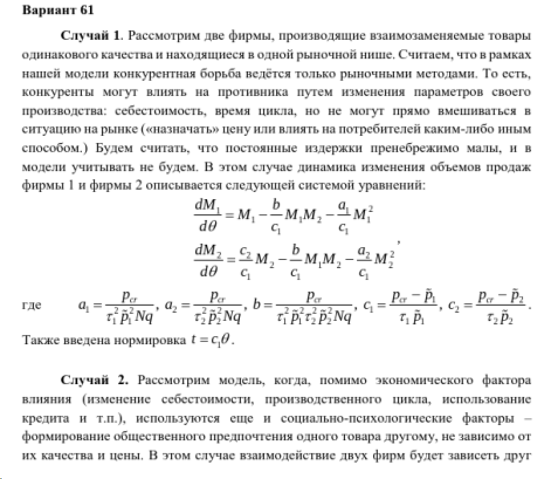
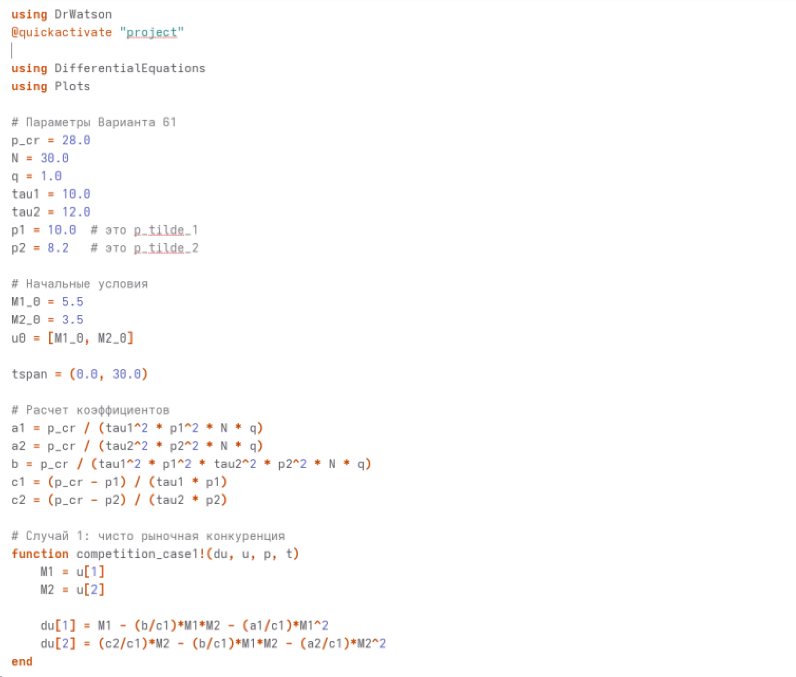
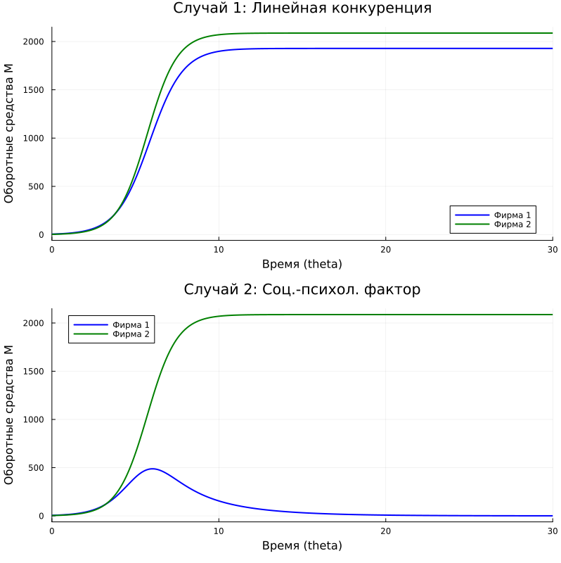
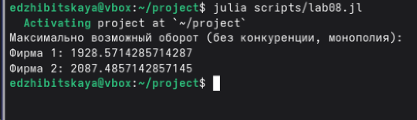

---
## Author
author:
  name: Жибицкая Евгения Дмитриевна
  degrees: 
  orcid: 0000-0002-0877-7063
  email: 1132236130@rudn.ru
  affiliation:
    - name: Российский университет дружбы народов
      country: Российская Федерация
      postal-code: 117198
      city: Москва
      address: ул. Миклухо-Маклая, д. 6

## Title
title: "Лабораторная работа №8"
subtitle: "Дисциплина: Математическое моделирование"
license: "CC BY"
---

# Цель работы

Построение модели конкуренции двух фирм.  Решение задачи с помощью моделирования, построение графиков изменения объемов оборотных средств каждой фирмы, нахождение стационарного состояния системы для первого случая.

# Выполнение лабораторной работы

Перед выполнением лабораторной работы необходимо определить номер варианта для решения задачи. Сделаем это (рис. [-@fig-001]).

{#fig-001 width=70%}

{#fig-002 width=70%}


## Математическая модель

В данной лабораторной работе рассматривается модель конкуренции двух фирм, производящих взаимозаменяемые товары одинакового качества и находящихся в одной рыночной нише. Считается, что у потребителей нет априорных предпочтений, и товар реализуется по единой рыночной цене $p$, зависящей от баланса спроса и предложения.

Главной переменной модели выступают оборотные средства предприятий $M_1$ и $M_2$.

Используются следующие вспомогательные коэффициенты, зависящие от параметров производства:
$$ a_1 = \frac{p_{cr}}{\tau_1^2 \tilde{p}_1^2 N q}, \quad a_2 = \frac{p_{cr}}{\tau_2^2 \tilde{p}_2^2 N q}, \quad b = \frac{p_{cr}}{\tau_1^2 \tilde{p}_1^2 \tau_2^2 \tilde{p}_2^2 N q} $$
$$ c_1 = \frac{p_{cr} - \tilde{p}_1}{\tau_1 \tilde{p}_1}, \quad c_2 = \frac{p_{cr} - \tilde{p}_2}{\tau_2 \tilde{p}_2} $$
Где $p_{cr}$ — критическая стоимость продукта, $N$ — число потребителей, $q$ — максимальная потребность одного человека, $\tau$ — длительность производственного цикла, $\tilde{p}$ — себестоимость.

Для упрощения решения вводится безразмерное время $\theta = \frac{t}{c_1}$.

### Случай 1: Конкуренция только рыночными методами
В первом случае конкурентная борьба ведется исключительно экономическими методами. Коэффициент конкурентного давления (пересечение интересов фирм) симметричен и равен $\frac{b}{c_1}$. Система дифференциальных уравнений имеет вид:

$$
\begin{cases}
\frac{dM_1}{d\theta} = M_1 - \frac{b}{c_1}M_1 M_2 - \frac{a_1}{c_1}M_1^2 \\
\frac{dM_2}{d\theta} = \frac{c_2}{c_1}M_2 - \frac{b}{c_1}M_1 M_2 - \frac{a_2}{c_1}M_2^2
\end{cases}
$$

Графики решения данной системы демонстрируют, что обе фирмы, несмотря на конкуренцию, достигают своих максимальных значений объема продаж и закрепляются на рынке. Банкротства не происходит.

### Поиск стационарного состояния для Случая 1
Стационарное состояние системы — это состояние равновесия, при котором объемы оборотных средств фирм перестают изменяться со временем. Математически это означает, что производные равны нулю: $\frac{dM_1}{d\theta} = 0$ и $\frac{dM_2}{d\theta} = 0$.

Исключая тривиальное решение $M_1=0, M_2=0$ (фирмы отсутствуют на рынке), разделим первое уравнение на $M_1$, а второе на $M_2$:
$$
\begin{cases}
1 - \frac{b}{c_1}M_2 - \frac{a_1}{c_1}M_1 = 0 \\
\frac{c_2}{c_1} - \frac{b}{c_1}M_1 - \frac{a_2}{c_1}M_2 = 0
\end{cases}
$$

Решая данную систему линейных алгебраических уравнений относительно $M_1$ и $M_2$, получаем координаты стационарной точки $(M_1^*, M_2^*)$:
$$ M_1^* = \frac{c_1 a_2 - c_2 b}{a_1 a_2 - b^2} $$
$$ M_2^* = \frac{a_1 c_2 - b c_1}{a_1 a_2 - b^2} $$
Именно к этим значениям асимптотически стремятся графики оборотных средств обеих фирм в первом случае.

### Случай 2: Влияние социально-психологических факторов
Во втором случае в модель вводится дополнительный фактор нечестной конкуренции (или формирование общественного предпочтения одного бренда другому, не зависящее от качества). В результате этого симметрия нарушается, и в уравнении первой фирмы коэффициент перед произведением $M_1 M_2$ изменяется (например, увеличивается на величину $\Delta$).

Система принимает вид:
$$
\begin{cases}
\frac{dM_1}{d\theta} = M_1 - \left(\frac{b}{c_1} + \Delta\right) M_1 M_2 - \frac{a_1}{c_1}M_1^2 \\
\frac{dM_2}{d\theta} = \frac{c_2}{c_1}M_2 - \frac{b}{c_1}M_1 M_2 - \frac{a_2}{c_1}M_2^2
\end{cases}
$$

Появление дополнительного фактора приводит к тому, что первая фирма (в отношении которой действует негативный социально-психологический фактор) начинает нести убытки после первоначального роста. В конечном итоге ее оборотные средства падают до нуля ($M_1 \to 0$), фирма терпит банкротство, а вторая фирма захватывает весь рынок.


## Программная реализация

Реализуем код на Julia.

```
using DrWatson
@quickactivate "project"

using DifferentialEquations
using Plots

# 61
p_cr = 28.0
N = 30.0
q = 1.0
tau1 = 10.0
tau2 = 12.0
p1 = 10.0  # это p_tilde_1
p2 = 8.2   # это p_tilde_2


M1_0 = 5.5
M2_0 = 3.5
u0 = [M1_0, M2_0]

tspan = (0.0, 30.0)


a1 = p_cr / (tau1^2 * p1^2 * N * q)
a2 = p_cr / (tau2^2 * p2^2 * N * q)
b = p_cr / (tau1^2 * p1^2 * tau2^2 * p2^2 * N * q)
c1 = (p_cr - p1) / (tau1 * p1)
c2 = (p_cr - p2) / (tau2 * p2)

#  1
function competition_case1!(du, u, p, t)
    M1 = u[1]
    M2 = u[2]
    
    du[1] = M1 - (b/c1)*M1*M2 - (a1/c1)*M1^2
    du[2] = (c2/c1)*M2 - (b/c1)*M1*M2 - (a2/c1)*M2^2
end

#  2
function competition_case2!(du, u, p, t)
    M1 = u[1]
    M2 = u[2]
    
   
    du[1] = M1 - (b/c1 + 0.00061)*M1*M2 - (a1/c1)*M1^2
    du[2] = (c2/c1)*M2 - (b/c1)*M1*M2 - (a2/c1)*M2^2
end

#  1
prob1 = ODEProblem(competition_case1!, u0, tspan)
sol1 = solve(prob1, Tsit5(), dtmax=0.1)

# 2
prob2 = ODEProblem(competition_case2!, u0, tspan)
sol2 = solve(prob2, Tsit5(), dtmax=0.1)


p1_plot = plot(sol1, label=["Фирма 1" "Фирма 2"], lw=2, color=[:blue :green],
          title="Случай 1: Линейная конкуренция",
          xlabel="Время (theta)", ylabel="Оборотные средства M")

p2_plot = plot(sol2, label=["Фирма 1" "Фирма 2"], lw=2, color=[:blue :green],
          title="Случай 2: Соц.-психол. фактор",
          xlabel="Время (theta)", ylabel="Оборотные средства M")

plot(p1_plot, p2_plot, layout=(2, 1), size=(800, 800))
savefig("plot/lab08.png")

M1_stationary = c1/a1
M2_stationary = c2/a2
println("Максимально возможный оборот (без конкуренции, монополия):")
println("Фирма 1: $M1_stationary")
println("Фирма 2: $M2_stationary")
```


Реализация кода ([рис. @fig-003] и [рис. @fig-004]).


{#fig-003 width=70%}

{#fig-004 width=70%}


```
model CompetitionCase1
  parameter Real p_cr = 28.0;
  parameter Real N = 30.0;
  parameter Real q = 1.0;
  parameter Real tau1 = 10.0;
  parameter Real tau2 = 12.0;
  parameter Real p1 = 10.0;
  parameter Real p2 = 8.2;
  parameter Real M1_0 = 5.5;
  parameter Real M2_0 = 3.5;

  parameter Real a1 = p_cr / (tau1^2 * p1^2 * N * q);
  parameter Real a2 = p_cr / (tau2^2 * p2^2 * N * q);
  parameter Real b = p_cr / (tau1^2 * p1^2 * tau2^2 * p2^2 * N * q);
  parameter Real c1 = (p_cr - p1) / (tau1 * p1);
  parameter Real c2 = (p_cr - p2) / (tau2 * p2);

  Real M1(start = M1_0);
  Real M2(start = M2_0);
  Real M1_stationary = c1 / a1;
  Real M2_stationary = c2 / a2;
equation
  der(M1) = M1 - (b / c1) * M1 * M2 - (a1 / c1) * M1^2;
  der(M2) = (c2 / c1) * M2 - (b / c1) * M1 * M2 - (a2 / c1) * M2^2;
  annotation(experiment(StopTime = 30.0, Interval = 0.1));
end CompetitionCase1;

model CompetitionCase2
  parameter Real p_cr = 28.0;
  parameter Real N = 30.0;
  parameter Real q = 1.0;
  parameter Real tau1 = 10.0;
  parameter Real tau2 = 12.0;
  parameter Real p1 = 10.0;
  parameter Real p2 = 8.2;
  parameter Real M1_0 = 5.5;
  parameter Real M2_0 = 3.5;
  parameter Real delta = 0.00061;

  parameter Real a1 = p_cr / (tau1^2 * p1^2 * N * q);
  parameter Real a2 = p_cr / (tau2^2 * p2^2 * N * q);
  parameter Real b = p_cr / (tau1^2 * p1^2 * tau2^2 * p2^2 * N * q);
  parameter Real c1 = (p_cr - p1) / (tau1 * p1);
  parameter Real c2 = (p_cr - p2) / (tau2 * p2);

  Real M1(start = M1_0);
  Real M2(start = M2_0);
  Real M1_stationary = c1 / a1;
  Real M2_stationary = c2 / a2;
equation
  der(M1) = M1 - (b / c1 + delta) * M1 * M2 - (a1 / c1) * M1^2;
  der(M2) = (c2 / c1) * M2 - (b / c1) * M1 * M2 - (a2 / c1) * M2^2;
  annotation(experiment(StopTime = 30.0, Interval = 0.1));
end CompetitionCase2;
```


Построенные модели([рис. @fig-005]) и результат([рис. @fig-006]).

{#fig-005 width=70%}

{#fig-006 width=70%}


# Выводы

В ходе работы была построена модель конкуренции двух фирм. Было произведено решение задачи с помощью моделирования, построение графиков изменения объемов оборотных средств каждой фирмы, нахождение стационарного состояния системы для первого случая.


# Список литературы{.unnumbered}

[ТУИС](https://esystem.rudn.ru/pluginfile.php/3094851/mod_resource/content/2/%D0%9B%D0%B0%D0%B1%D0%BE%D1%80%D0%B0%D1%82%D0%BE%D1%80%D0%BD%D0%B0%D1%8F%20%D1%80%D0%B0%D0%B1%D0%BE%D1%82%D0%B0%20%E2%84%96%207.pdf)

::: {#refs}
:::
